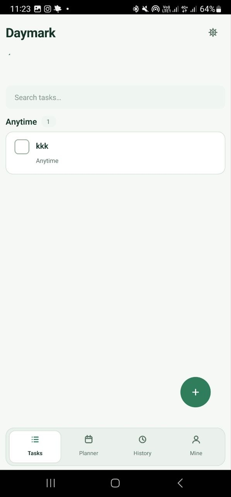
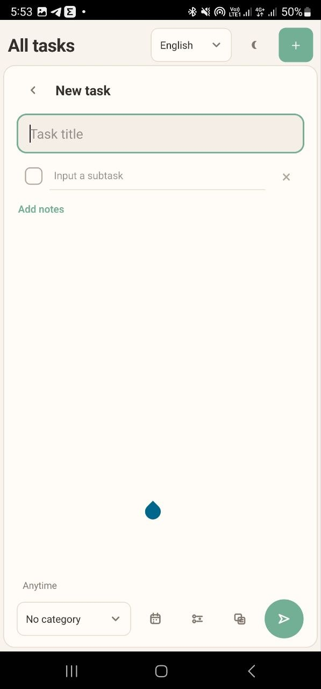
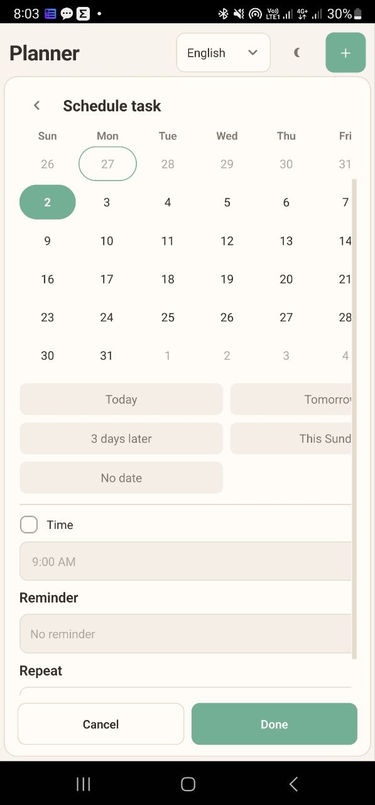

# Daymark

[](https://github.com/phoenix-0011/Daymark/actions/workflows/ci.yml)

Daymark یک برنامه مدیریت وظایف و برنامه‌ریزی شخصی برای Android است که با Python، PySide6/Qt و SQLite توسعه داده شده است. برنامه به‌صورت آفلاین کار می‌کند و اطلاعات اصلی کاربر را در فضای محلی برنامه نگه می‌دارد.

## اعضای تیم

| عضو تیم | نقش اصلی |
|---|---|
| علی ابراهیمی نیا | معمار نرم‌افزار و توسعه‌دهنده منطق هسته |
| امیرحسین رابعی | توسعه‌دهنده رابط کاربری |
| مهدی ابراهیم زاده | توسعه‌دهنده رابط کاربری |
| مجتبی محمودی | طراح UI/UX |
| علی رضا زاده | توسعه‌دهنده پایگاه داده |
| مهدی نریمانی | طراح UI/UX |

[شرح کامل فعالیت اعضای تیم](docs/10_team_contributions.md)

## قابلیت‌ها

- ایجاد، ویرایش، تکمیل، بازیابی و حذف وظیفه
- زیرکار، یادداشت، دسته‌بندی، جست‌وجو و فیلتر
- زمان‌بندی تاریخ و ساعت، یادآور درون‌برنامه‌ای و وظایف تکرارشونده
- برنامه‌ریزی روزانه، هفتگی و ماهانه
- تاریخچه وظایف و بازیابی
- Mine/Insights، آمار عملکرد و تقویم حرارتی
- حالت روشن و تاریک
- پالت‌های Warm Sage، Sky Blue و Aristocratic Green
- رابط انگلیسی و ترکی
- ذخیره محلی SQLite و عدم نیاز به حساب کاربری یا سرور

## تصاویر واقعی برنامه

<p align="center">
  
  
  
</p>

## وضعیت کیفیت تأییدشده

در بررسی ثبت‌شده 2026-07-30:

- `42` تست خودکار اجرا و همگی پاس شدند.
- Coverage هسته غیرگرافیکی پروژه حدود `92%` است.
- یک اشکال واقعی Migration مربوط به دیتابیس قدیمی شناسایی و اصلاح شد.
- تست‌های Android واقعی مانند Keyboard، Back، Lifecycle، Performance و نصب APK همچنان باید برای هر Build نهایی با Checklist ثبت شوند.

جزئیات:

- [راهبرد تست](docs/05_testing_strategy.md)
- [Test Caseها](docs/11_test_cases.md)
- [گزارش اجرای تست](docs/12_test_execution_report.md)
- [ماتریس ردیابی](docs/13_requirements_traceability_matrix.md)

## مستندات

[فهرست کامل مستندات فارسی پروژه](docs/README.md)

اسناد شامل نیازمندی‌ها، روش توسعه، معماری، پیاده‌سازی، تست، QA، استقرار، امنیت، مشارکت اعضا، راهنمای کاربر، ADRها، سناریوی ارائه و Checklistهای Release/UAT هستند.

## فناوری‌ها

- Python 3.11
- PySide6 / Qt
- SQLite
- python-for-android و Buildozer
- pytest و Coverage
- Ruff، Bandit و pip-audit در CI
- PlantUML

## نصب وابستگی‌های توسعه

```bash
python3.11 -m venv .venv
source .venv/bin/activate
python -m pip install --upgrade pip
pip install -r requirements.txt -r requirements-dev.txt
```

## اجرای بررسی‌های کیفیت

بررسی مستقل و بدون وابستگی خارجی:

```bash
python tools/quality_check.py
```

تست و Coverage:

```bash
python -m pytest -q
python -m coverage run -m pytest -q
python -m coverage report -m
```

همه بررسی‌های محلی:

```bash
chmod +x tools/run_quality_checks.sh
./tools/run_quality_checks.sh
```

## ساخت APK

```bash
chmod +x build_android.sh
./build_android.sh
```

خروجی Debug:

```text
dist-android/Daymark-debug-arm64-v8a.apk
```

APK داخل Repository Commit نمی‌شود و باید در GitHub Releases قرار گیرد.

## راهنماهای پروژه

- [راهنمای استفاده](docs/15_user_guide.md)
- [راهنمای مشارکت](CONTRIBUTING.md)
- [حریم خصوصی](PRIVACY.md)
- [امنیت](SECURITY.md)
- [تغییرات نسخه‌ها](CHANGELOG.md)
- [سناریوی ارائه و Demo](docs/16_presentation_and_demo.md)

## محدودیت‌های فعلی

- نسخه منتشرشده دانشگاهی Debug Build است و Production-signed محسوب نمی‌شود.
- اعلان پس‌زمینه Android در نسخه فعلی پیاده‌سازی نشده است؛ یادآور در زمان بازبودن برنامه بررسی می‌شود.
- Cloud Sync، حساب کاربری و نسخه iOS در دامنه فعلی نیستند.
- نتیجه Test Caseهای دستگاه واقعی باید برای Build نهایی به‌صورت جداگانه ثبت شود.
