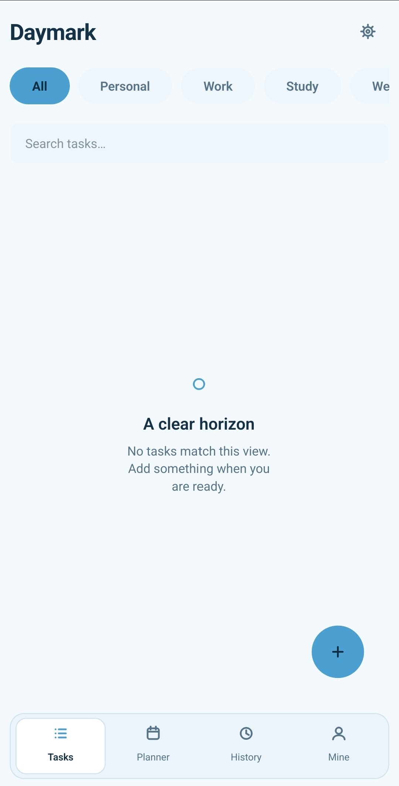
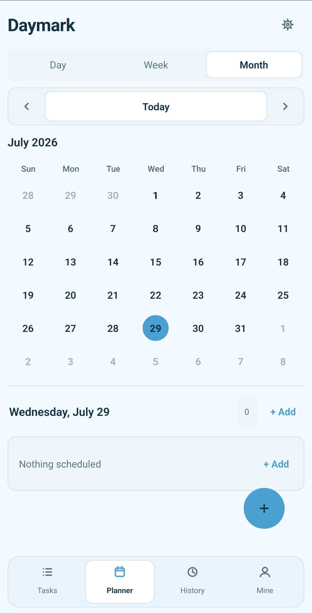
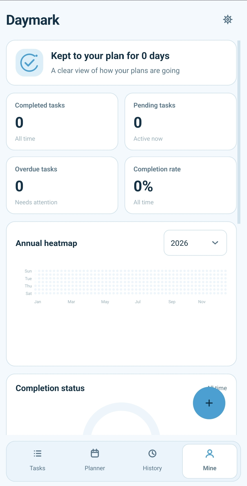

<div dir="rtl">

# Daymark

Daymark یک برنامه مدیریت وظایف و برنامه‌ریزی شخصی برای Android است که با Python، PySide6، Qt و SQLite توسعه داده شده
است.

این برنامه به‌صورت آفلاین کار می‌کند و اطلاعات کاربر را به‌صورت محلی روی دستگاه ذخیره می‌کند.

## قابلیت‌ها

- ایجاد، ویرایش، تکمیل، بازیابی و حذف وظیفه
- افزودن زیرکار و یادداشت
- زمان‌بندی وظایف بر اساس تاریخ و ساعت
- تعریف وظایف تکرارشونده
- سازمان‌دهی وظایف با دسته‌بندی‌های قابل مدیریت
- جست‌وجو و فیلتر وظایف
- نمایش برنامه به‌صورت روزانه، هفتگی و ماهانه
- مشاهده تاریخچه وظایف
- نمایش آمار عملکرد و تقویم حرارتی سالانه
- حالت روشن و تاریک
- پالت‌های Warm Sage، Sky Blue و Aristocratic Green
- رابط کاربری انگلیسی و ترکی
- ذخیره‌سازی آفلاین با SQLite
- طراحی واکنش‌گرا برای نمایشگرهای موبایل
- کنترل لمسی و ناوبری پایین صفحه

## تصاویر برنامه

تصاویر برنامه در مسیر زیر قرار می‌گیرند:

```text
docs/screenshots/
```

نمونه نمایش تصاویر:

<p align="center">
  
  
  
</p>

> نام تصاویر واقعی باید با مسیرهای بالا یکسان باشد.

## دانلود نسخه Android

نسخه APK برنامه از بخش Releases مخزن قابل دریافت است:

[مشاهده نسخه‌های منتشرشده](../../releases)

> نسخه فعلی برای ارائه و آزمایش پروژه منتشر شده است. هنگام نصب خارج از Google Play ممکن است هشدار Play Protect نمایش
> داده شود.

## نیازمندی‌های اجرا

- Android 9 یا جدیدتر
- دستگاه با معماری ARM64-v8a
- بدون نیاز به اتصال اینترنت
- فعال‌کردن اجازه نصب از منابع ناشناس برای نصب مستقیم APK

## فناوری‌های استفاده‌شده

- Python 3.11
- PySide6 / Qt
- SQLite
- python-for-android
- Buildozer
- PlantUML
- pytest

## ساختار پروژه

```text
Daymark/
├── daymark/                 # کد اصلی برنامه
├── tests/                   # تست‌های خودکار
├── tools/                   # ابزارهای کمکی ساخت
├── docs/                    # مستندات فارسی و نمودارها
│   ├── diagrams/            # فایل‌های PlantUML و SVG
│   └── screenshots/         # تصاویر برنامه
├── main.py                  # نقطه شروع برنامه
├── icon.png                 # آیکون برنامه
├── build_android.sh         # ساخت APK
├── install_android.sh       # نصب APK روی دستگاه
├── requirements.txt         # وابستگی‌های Python
├── README.md
└── .gitignore
```

## مستندات پروژه

مستندات کامل فارسی پروژه در پوشه `docs` قرار دارد:

[مشاهده مستندات](docs/README.md)

این مستندات شامل موارد زیر است:

- مهندسی نیازمندی‌ها و SRS
- روش توسعه نرم‌افزار
- طراحی و معماری
- نمودارهای UML و PlantUML
- بهترین روش‌های پیاده‌سازی
- راهبرد تست
- تضمین کیفیت
- استقرار Android
- امنیت، حریم خصوصی و اخلاق

## نمودارها

فایل‌های منبع PlantUML و خروجی‌های SVG در مسیر زیر قرار دارند:

```text
docs/diagrams/
```

برای ساخت مجدد نمودارها:

```bash
plantuml -charset UTF-8 -tsvg docs/diagrams/*.puml
```

## اجرای تست‌ها

```bash
python -m unittest discover -s tests -v
```

یا در صورت استفاده از pytest:

```bash
pytest
```

## ساخت APK

پیش‌نیازهای ساخت:

- Python 3.11
- JDK 17
- Android SDK
- Android NDK

ساخت برنامه:

```bash
chmod +x build_android.sh
./build_android.sh
```

فایل APK ساخته‌شده در مسیر زیر قرار می‌گیرد:

```text
dist-android/Daymark-debug-arm64-v8a.apk
```

## نصب روی دستگاه Android

پس از فعال‌کردن USB Debugging و اتصال دستگاه:

```bash
chmod +x install_android.sh
./install_android.sh
```

## ذخیره‌سازی اطلاعات

تمام وظایف، دسته‌بندی‌ها، تنظیمات و اطلاعات عملکرد به‌صورت محلی در SQLite ذخیره می‌شوند. Daymark برای عملکرد اصلی خود به
حساب کاربری، سرور یا سرویس ابری نیاز ندارد.

## وضعیت پروژه

این نسخه برای ارائه دانشگاهی، بررسی کد، نمایش مستندات و آزمایش روی دستگاه Android آماده شده است.

## توسعه‌ دهندگان

**علی ابراهیمی نیا،**
**امیرحسین رابعی،**
**مهدی ابراهیم زاده،**
**مجتبی محمودی،**
**علی رضا زاده،**
**مهدی نریمانی**

پروژه دانشگاهی مهندسی نرم‌افزار

</div>