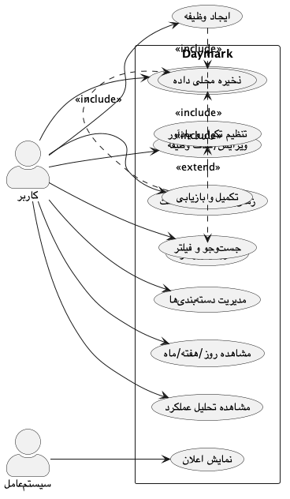
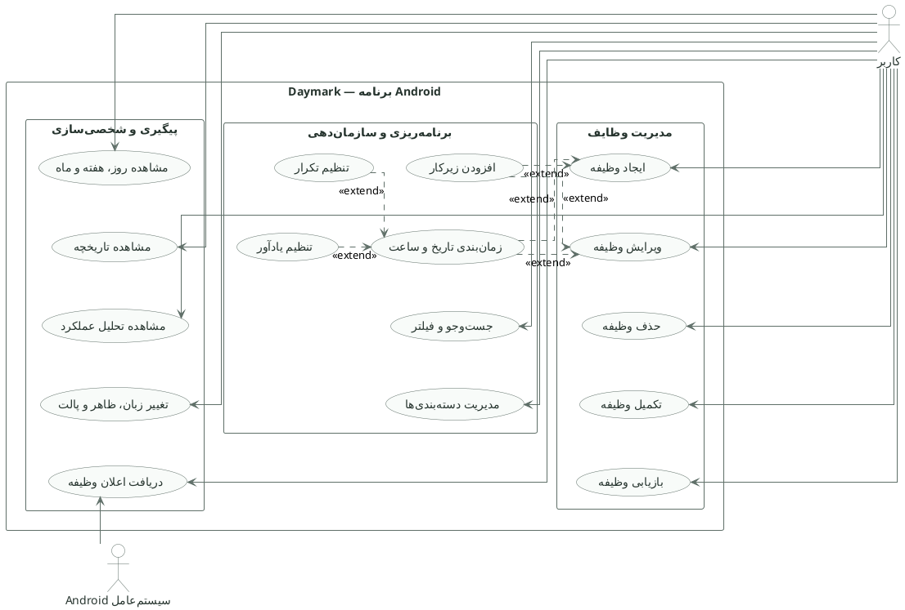

# مهندسی نیازمندی‌ها و مشخصات نیازمندی‌های نرم‌افزار (SRS)

> **پروژه:** Daymark  
> **نوع محصول:** برنامه مدیریت وظایف و برنامه‌ریزی محلی (Local-first) برای Android  
> **فناوری‌های اصلی:** Python 3.11، PySide6/Qt، SQLite، Buildozer و python-for-android  
> **دامنه فعلی:** تک‌کاربره، بدون حساب ابری و بدون انتقال داده به سرور
> **تیم توسعه:** علی ابراهیمی نیا، امیرحسین رابعی، مهدی ابراهیم زاده، مجتبی محمودی، علی رضا زاده و مهدی نریمانی  
> **شیوه تقسیم کار:** معماری و منطق هسته، رابط کاربری، طراحی UI/UX و پایگاه داده؛ تست، بازبینی و مستندسازی به‌صورت مشترک و متناسب با حوزه هر عضو انجام شده است.

## مسئولیت تیم در تدوین نیازمندی‌ها

| عضو | مسئولیت مرتبط با این سند |
|---|---|
| علی ابراهیمی نیا | تبدیل نیازهای محصول به قیود فنی، بررسی امکان‌پذیری و تعیین نیازهای منطق هسته |
| امیرحسین رابعی | استخراج نیازهای اجرایی صفحات Tasks، History و فرم ساخت و ویرایش وظیفه |
| مهدی ابراهیم زاده | استخراج نیازهای اجرایی Planner، Settings، Mine و رفتارهای موبایلی |
| مجتبی محمودی | تحلیل جریان کاربر، نیازهای کاربردپذیری و معیارهای پذیرش رابط |
| علی رضا زاده | تعیین نیازهای ذخیره‌سازی، تراکنش، مهاجرت و یکپارچگی داده |
| مهدی نریمانی | تحلیل دسترس‌پذیری، طراحی تعاملی، پالت‌ها و تجربه نماهای برنامه‌ریزی |

نیازمندی‌های نهایی پس از بررسی مشترک تیم تثبیت شده‌اند.

## 1. هدف سند

این سند مشخص می‌کند Daymark چه کاری باید انجام دهد، چه محدودیت‌هایی دارد، کیفیت مورد انتظار آن چیست و معیار پذیرش قابلیت‌های اصلی چگونه سنجیده می‌شود. این سند مرجع مشترک طراحی، پیاده‌سازی، تست و پذیرش است.

## 2. چشم‌انداز محصول

Daymark یک برنامه آرام، سریع و محلی برای ثبت و برنامه‌ریزی وظایف است. کاربر باید بتواند بدون ایجاد حساب، بدون اینترنت و بدون پیچیدگی ابزارهای مدیریت پروژه، وظایف روزانه خود را ایجاد، دسته‌بندی، زمان‌بندی، تکمیل و تحلیل کند.

## 3. ذی‌نفعان

| ذی‌نفع | نیاز یا مسئولیت اصلی |
|---|---|
| کاربر نهایی | ثبت سریع وظیفه، برنامه‌ریزی قابل‌فهم، رابط روان و حفظ حریم خصوصی |
| علی ابراهیمی نیا | امکان‌پذیری فنی، معماری، منطق هسته و یکپارچه‌سازی |
| امیرحسین رابعی و مهدی ابراهیم زاده | قابلیت پیاده‌سازی رابط، واکنش‌گرایی و تعامل صحیح Android |
| مجتبی محمودی و مهدی نریمانی | کاربردپذیری، انسجام بصری، دسترس‌پذیری و جریان کاربر |
| علی رضا زاده | صحت ذخیره‌سازی، یکپارچگی داده، migration و بازیابی |
| سیستم‌عامل Android | چرخه عمر، فضای خصوصی برنامه، صفحه‌کلید، Back، اعلان و مجوزها |

## 4. دامنه

### در دامنه نسخه فعلی

- وظیفه، زیرکار، یادداشت، دسته‌بندی و ستاره‌دار کردن
- تاریخ، ساعت، تکرار و یادآور
- نماهای Tasks، Planner، History و Mine
- برنامه‌ریزی روزانه، هفتگی و ماهانه
- جست‌وجو و فیلتر دسته‌بندی
- بازیابی وظیفه تکمیل‌شده
- تحلیل محلی مانند نرخ تکمیل، streak و heatmap
- حالت روشن/تاریک و پالت‌های رنگی
- زبان انگلیسی و ترکی
- ذخیره محلی SQLite

### خارج از دامنه فعلی

- ثبت‌نام و ورود کاربر
- همگام‌سازی چنددستگاهی
- همکاری تیمی و اشتراک وظیفه
- API ابری و پنل وب
- اعلان تضمین‌شده Android در زمانی که برنامه کاملاً بسته است

## 5. نیازمندی‌های عملکردی

| شناسه | نیازمندی | معیار پذیرش اصلی |
|---|---|---|
| FR-01 | ایجاد وظیفه | با عنوان معتبر، وظیفه ذخیره و فوراً در نمای مناسب دیده شود. |
| FR-02 | ویرایش وظیفه | تغییر عنوان، یادداشت، دسته‌بندی و زمان‌بندی بدون از دست رفتن زیرکارها ذخیره شود. |
| FR-03 | حذف وظیفه | پس از تأیید کاربر، وظیفه و زیرکارهای وابسته حذف شوند. |
| FR-04 | مدیریت زیرکار | افزودن، حذف، مرتب‌سازی و ثبت وضعیت تکمیل زیرکار ممکن باشد. |
| FR-05 | دسته‌بندی | ایجاد و حذف دسته‌بندی رنگی ممکن باشد؛ حذف دسته‌بندی نباید وظایف را حذف کند. |
| FR-06 | جست‌وجو | عنوان، یادداشت و متن زیرکار در جست‌وجو لحاظ شوند. |
| FR-07 | فیلتر | فیلتر All و دسته‌بندی‌های کاربر بالای Search نمایش داده شوند. |
| FR-08 | زمان‌بندی | کاربر بتواند تاریخ اختیاری، ساعت اختیاری و حالت all-day را تعیین کند. |
| FR-09 | تکرار | تکرار روزانه، روزهای کاری، هفتگی و ماهانه پشتیبانی شود. |
| FR-10 | رخداد بعدی | تکمیل وظیفه تکرارشونده باید رخداد بعدی را فقط یک‌بار ایجاد کند. |
| FR-11 | یادآور | برای وظیفه دارای تاریخ و ساعت، فاصله یادآوری قابل انتخاب باشد. |
| FR-12 | نماهای Planner | روز، هفته و ماه باید وظایف زمان‌بندی‌شده را نمایش دهند. |
| FR-13 | History | وظایف تکمیل‌شده نمایش داده و قابل بازیابی باشند. |
| FR-14 | Restore امن | بازیابی یک وظیفه تکرارشونده فقط رخداد خودکار متناظر را حذف کند، نه نسخه دستی مشابه. |
| FR-15 | Swipe actions | Star، Date و Delete از طریق swipe در موبایل قابل دسترس باشند و در حالت بسته دیده نشوند. |
| FR-16 | Mine/Insights | آمار تکمیل، overdue، streak، نمودار هفتگی، دسته‌ها و heatmap محاسبه شوند. |
| FR-17 | تنظیمات | زبان، حالت روشن/تاریک، پالت رنگ و دسته‌بندی‌ها از Settings مدیریت شوند. |
| FR-18 | پالت | Warm Sage، Sky Blue و Aristocratic Green در روشن و تاریک اعمال و ذخیره شوند. |
| FR-19 | ذخیره محلی | داده‌ها بعد از بستن و بازکردن برنامه باقی بمانند. |
| FR-20 | رفتار Back | Back ابتدا صفحه‌کلید/دیالوگ فعال را ببندد و رویدادهای کاذب IME باعث خروج نشوند. |
| FR-21 | خطا | خطای کنترل‌نشده در فایل crash log ثبت شود و داده تراکنش ناقص نماند. |
| FR-22 | Android Build | اسکریپت ساخت باید APK ARM64 قابل نصب و قابل تأیید تولید کند. |

## 6. نیازمندی‌های غیرعملکردی

### 6.1 کارایی

- بازشدن صفحه اصلی روی دستگاه هدف در شرایط عادی حداکثر حدود ۲ ثانیه باشد.
- عملیات محلی متداول مانند ایجاد یا تکمیل وظیفه در کمتر از ۳۰۰ میلی‌ثانیه بازخورد بصری بدهد.
- جست‌وجو debounce شود و برای هر حرف، چندین بازسازی هم‌زمان ایجاد نکند.
- اسکرول فهرست با حداقل ۵۰۰ وظیفه و ۱۰۰۰ زیرکار قابل استفاده باقی بماند.

### 6.2 مقیاس‌پذیری

مقیاس‌پذیری فعلی به معنی تحمل رشد داده روی یک دستگاه است، نه توزیع افقی. پایگاه داده باید با indexهای مناسب، خواندن وظایف بر اساس وضعیت، تاریخ و دسته‌بندی را کارآمد نگه دارد.

### 6.3 قابلیت اطمینان

- همه عملیات چندمرحله‌ای پایگاه داده داخل transaction اجرا شوند.
- تکمیل دوباره یک وظیفه idempotent باشد.
- قطع برنامه هنگام ذخیره نباید وظیفه نیمه‌کاره یا زیرکار orphan ایجاد کند.
- مهاجرت schema باید داده قبلی را حفظ کند.

### 6.4 امنیت و حریم خصوصی

- داده در فضای خصوصی برنامه ذخیره شود.
- SQL با placeholder پارامتری اجرا شود.
- برنامه در نسخه فعلی داده‌ای به شبکه ارسال نکند.
- بسته انتشار با کلید release امضا شود.

### 6.5 کاربردپذیری

- هدف‌های لمسی موبایل حداقل حدود ۴۴ تا ۴۸ پیکسل منطقی باشند.
- پنجره‌های موبایل از عرض viewport تجاوز نکنند و اسکرول افقی ناخواسته نداشته باشند.
- صفحه‌کلید نباید فیلد فعال و دکمه Save را غیرقابل دسترس کند.
- عنوان ثابت برنامه «Daymark» باقی بماند و مسیر فعلی با navigation مشخص شود.

### 6.6 نگهداری‌پذیری

- منطق پایگاه داده، UI، تحلیل، recurrence و theme در ماژول‌های جدا باشد.
- type hint و dataclass برای مدل‌های دامنه استفاده شود.
- هر باگ بحرانی با تست regression همراه شود.

### 6.7 سازگاری با Android

کد باید برای Android طراحی شود و روی نسخه‌های هدف سیستم‌عامل و اندازه‌های مختلف نمایشگر آزمایش شود. تعامل با صفحه‌کلید، دکمه Back، اعلان‌ها، چرخه عمر و فضای ذخیره‌سازی باید در لایه‌های مشخص Android و adapterهای دستگاه متمرکز بماند.

### 6.8 دسترس‌پذیری

- نسبت کنتراست متن اصلی حداقل 4.5:1 باشد.
- اطلاعات فقط با رنگ منتقل نشوند.
- کنترل‌ها نام و tooltip/accessible name معنادار داشته باشند.
- اندازه متن با تنظیمات سیستم تا حد ممکن سازگار باشد.

## 7. User Storyها

### US-01: ثبت سریع وظیفه

**به‌عنوان** کاربر، **می‌خواهم** با لمس دکمه + فوراً عنوان وظیفه را بنویسم، **تا** ایده یا تعهد خود را از دست ندهم.

معیار پذیرش:

- Composer در بالای صفحه و بالای صفحه‌کلید باز شود.
- فیلد عنوان focus بگیرد.
- Save بدون عنوان، پیام اعتبارسنجی نشان دهد.
- پس از ذخیره، وظیفه در فهرست صحیح دیده شود.

### US-02: برنامه‌ریزی تاریخ

**به‌عنوان** کاربر، **می‌خواهم** Today، Tomorrow، 3 days later یا یک روز تقویم را انتخاب کنم، **تا** زمان انجام را سریع تعیین کنم.

معیار پذیرش:

- انتخاب تاریخ باعث پرش عمودی پنجره نشود.
- کل پنجره فقط عمودی scroll شود.
- تقویم هفت ستون را کامل نشان دهد.

### US-03: حفظ حریم خصوصی

**به‌عنوان** کاربر، **می‌خواهم** داده‌های من بدون حساب و اینترنت روی دستگاه بماند، **تا** کنترل کامل اطلاعاتم را داشته باشم.

معیار پذیرش:

- برنامه بدون شبکه کار کند.
- هیچ درخواست شبکه‌ای برای داده وظایف اجرا نشود.
- حذف برنامه مطابق رفتار سیستم‌عامل، داده خصوصی آن را حذف کند.

### US-04: تحلیل پیشرفت

**به‌عنوان** کاربر، **می‌خواهم** روند تکمیل و streak را ببینم، **تا** الگوی کاری خود را ارزیابی کنم.

معیار پذیرش:

- محاسبات فقط از داده محلی انجام شوند.
- سال heatmap کامل و بدون clipping نمایش داده شود.
- آمار پس از تکمیل یا بازیابی وظیفه به‌روز شود.

## 8. Use Caseهای کلیدی

### UC-01: ایجاد وظیفه

- **پیش‌شرط:** برنامه باز است.
- **جریان اصلی:** لمس +، ورود عنوان، تنظیم گزینه‌های اختیاری، Save، transaction پایگاه داده، refresh فهرست.
- **جریان جایگزین:** عنوان خالی است؛ ذخیره متوقف و پیام نمایش داده می‌شود.
- **پس‌شرط:** وظیفه و زیرکارهای معتبر به‌صورت اتمی ذخیره شده‌اند.

### UC-02: تکمیل وظیفه تکرارشونده

- **پیش‌شرط:** وظیفه فعال و recurrence غیر از none است.
- **جریان اصلی:** ثبت completed_at، محاسبه تاریخ بعدی، ساخت رخداد جدید با زیرکارهای resetشده، commit.
- **پس‌شرط:** وظیفه قبلی در History و رخداد بعدی در فهرست فعال است.

### UC-03: بازیابی وظیفه

- **جریان اصلی:** انتخاب Restore، حذف رخداد خودکار متناظر در صورت وجود، پاک‌کردن completed_at، refresh.
- **قید:** نسخه دستی مشابه نباید حذف شود.

## 9. نمودار Use Case

<p align="center">
  
</p>

<p align="center"><em>نمودار موارد کاربرد Daymark برای Android؛ جزئیات پیاده‌سازی مانند پایگاه داده در این نمودار نمایش داده نشده‌اند.</em></p>

> **نکته UML:** زیرکار، زمان‌بندی، تکرار و یادآور قابلیت‌های اختیاری‌اند؛ بنابراین با رابطه `extend` و با جهت از Use Case توسعه‌دهنده به Use Case پایه نمایش داده شده‌اند.

### کد منبع PlantUML



فایل مستقل: [`diagrams/01_use_case.puml`](diagrams/01_use_case.puml)

## 10. ردیابی نیازمندی‌ها

برای هر Issue یا Pull Request باید شناسه FR/NFR مرتبط ثبت شود. نمونه:

```text
Fix schedule viewport overflow
Requirements: FR-08, NFR-Usability, NFR-Portability
Tests: test_schedule_vertical_lock, physical-device checklist SCH-03
```

## 11. شناسه‌های NFR برای ردیابی تست

برای ایجاد ارتباط دقیق با Test Caseها، دسته‌های نیازمندی غیرعملکردی با شناسه‌های زیر ارجاع داده می‌شوند:

| شناسه | دسته |
|---|---|
| NFR-PERFORMANCE | کارایی |
| NFR-SCALABILITY | مقیاس‌پذیری داده محلی |
| NFR-RELIABILITY | قابلیت اطمینان و Transaction |
| NFR-SECURITY | امنیت و حریم خصوصی |
| NFR-USABILITY | کاربردپذیری |
| NFR-MAINTAINABILITY | نگهداری‌پذیری |
| NFR-ANDROID | سازگاری با Android |
| NFR-ACCESSIBILITY | دسترس‌پذیری |

ماتریس ردیابی کامل:

[`13_requirements_traceability_matrix.md`](13_requirements_traceability_matrix.md)
