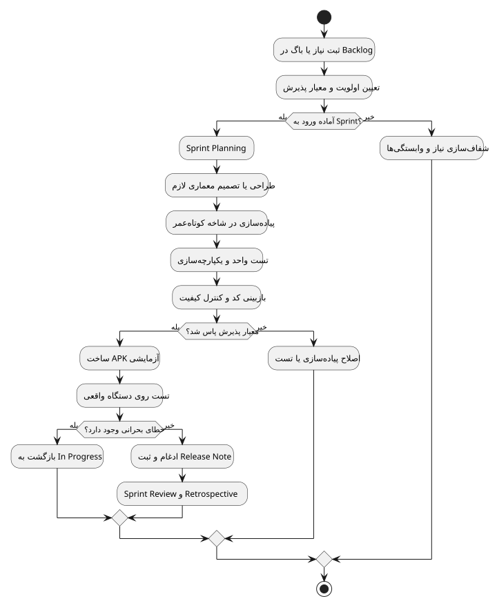
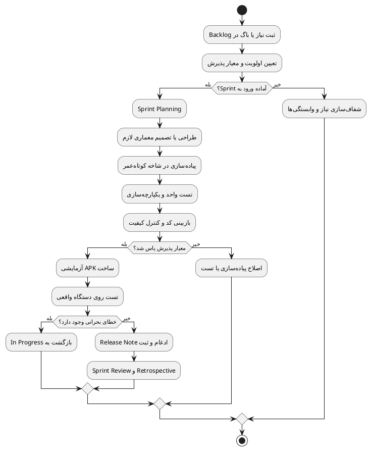

<div dir="rtl">

# روش توسعه نرم‌افزار

> **پروژه:** Daymark  
> **نوع محصول:** برنامه مدیریت وظایف و برنامه‌ریزی محلی (Local-first) برای Android  
> **فناوری‌های اصلی:** Python 3.11، PySide6/Qt، SQLite، Buildozer و python-for-android  
> **دامنه فعلی:** تک‌کاربره، بدون حساب ابری و بدون انتقال داده به سرور

## 1. روش پیشنهادی: Scrumban سبک

برای Daymark، روش **Scrumban** مناسب‌تر از Scrum سنگین یا Waterfall است. محصول رابط‌محور است، بازخورد دستگاه واقعی زیاد
دارد و باگ‌های Android معمولاً پس از تست لمسی آشکار می‌شوند. بنابراین به برنامه‌ریزی Sprint نیاز داریم، ولی جریان Kanban
برای باگ‌ها و اصلاحات سریع نیز ضروری است.

## 2. طول iteration

- Sprint عادی: یک هفته
- Hotfix بحرانی: خارج از Sprint، با تست regression اجباری
- Release candidate: پس از بسته‌شدن معیارهای پذیرش Sprint

## 3. نقش‌ها

در تیم کوچک ممکن است یک نفر چند نقش داشته باشد، اما مسئولیت‌ها باید جدا بمانند:

| نقش                      | مسئولیت                                         |
|--------------------------|-------------------------------------------------|
| Product Owner            | اولویت قابلیت‌ها، پذیرش خروجی و حفظ دامنه محصول |
| Scrum Master/Facilitator | رفع مانع، نظم فرایند و retrospective            |
| Developer                | طراحی، پیاده‌سازی، تست واحد و مستندسازی         |
| Reviewer                 | بررسی مستقل تغییرات، ریسک و regression          |
| Tester/UAT               | اجرای سناریو روی دستگاه واقعی و ثبت شواهد       |

## 4. ستون‌های Kanban

```text
Backlog → Ready → In Progress → Code Review → Device Test → Done
```

محدودیت WIP پیشنهادی:

- In Progress: حداکثر ۲ مورد برای هر توسعه‌دهنده
- Code Review: حداکثر ۳ مورد
- Device Test: حداکثر ۲ build فعال

## 5. مراسم‌ها

### Sprint Planning

- انتخاب موارد Ready
- مرور وابستگی و ریسک Android
- تعریف معیار پذیرش و تست
- تخمین با Story Point یا اندازه S/M/L

### Daily Stand-up

حداکثر ۱۰ دقیقه:

- چه چیزی تکمیل شد؟
- گام بعدی چیست؟
- چه مانعی وجود دارد؟

### Sprint Review

- نمایش build واقعی، نه فقط کد
- اجرای سناریوی پذیرش روی موبایل
- ثبت موارد ردشده به‌عنوان backlog جدید

### Retrospective

تمرکز بر فرایند:

- کدام خطا باید با تست خودکار پوشش داده شود؟
- کدام بخش build یا deployment هنوز دستی و شکننده است؟
- چه چیزی باعث دوباره‌کاری UI شد؟

## 6. Definition of Ready

یک مورد زمانی Ready است که:

- مسئله و رفتار فعلی روشن باشد.
- رفتار مطلوب و معیار پذیرش نوشته شده باشد.
- screenshot/log در صورت نیاز پیوست شده باشد.
- ریسک داده، UI، build و سازگاری مشخص باشد.
- وابستگی حل‌نشده نداشته باشد.

## 7. Definition of Done

- کد compile می‌شود.
- تست‌های موجود پاس می‌شوند.
- تست regression افزوده شده یا دلیل عدم امکان ثبت شده است.
- روی محیط Android Debug و حداقل یک دستگاه واقعی Android بررسی شده است.
- مستند مرتبط و Release Note به‌روز شده است.
- تغییر، داده قبلی یا build cache را بی‌دلیل حذف نمی‌کند.

## 8. مدیریت Backlog

برچسب‌های پیشنهادی:

- `feature`
- `bug`
- `critical-android`
- `ux`
- `database`
- `build`
- `security`
- `accessibility`
- `documentation`
- `regression-test-needed`

اولویت:

1. خرابی داده یا crash
2. مسدودشدن ساخت یا نصب
3. مشکل صفحه‌کلید، navigation و تعامل اصلی
4. کارایی و smoothness
5. کیفیت بصری
6. قابلیت جدید

## 9. مدیریت تغییر

هر تغییر معماری مهم باید ADR داشته باشد. نمونه تصمیم‌ها:

- انتخاب modular monolith به‌جای microservice
- نگهداری داده فقط در SQLite محلی
- استفاده از PySide6/Qt برای رابط Android و جداسازی رفتارهای وابسته به سیستم‌عامل
- coalescing refreshها به‌جای refresh مستقیم و تکراری

## 10. نمودار جریان iteration

<p align="center">
  
</p>

<p align="center"><em>جریان iteration از Backlog تا ساخت و ارزیابی نسخه</em></p>

### کد منبع PlantUML



فایل مستقل: [`diagrams/02_agile_flow.puml`](diagrams/02_agile_flow.puml)

</div>