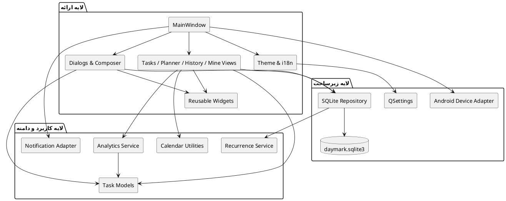
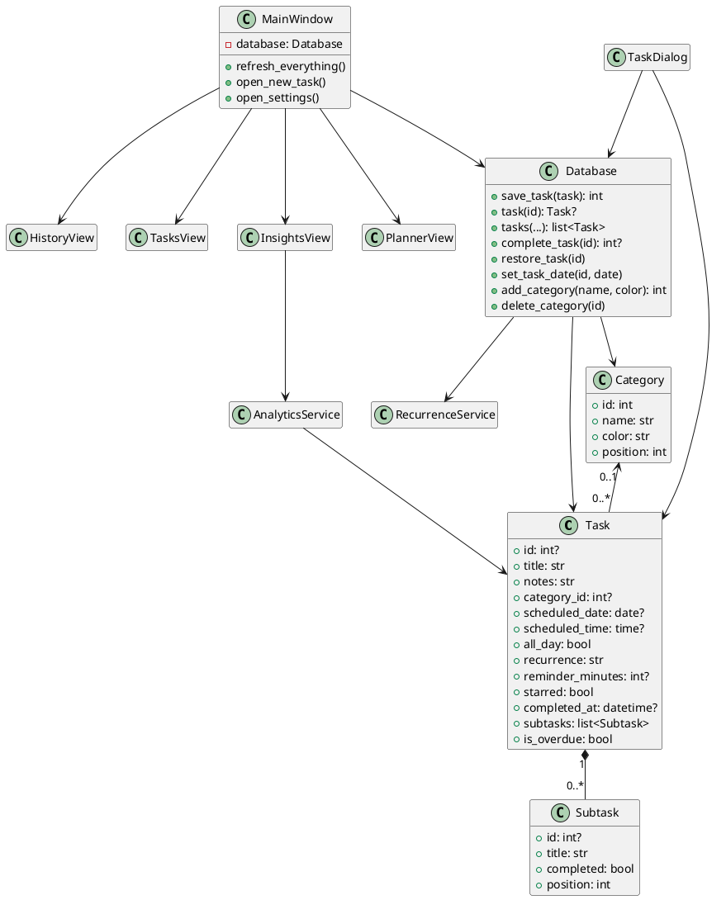
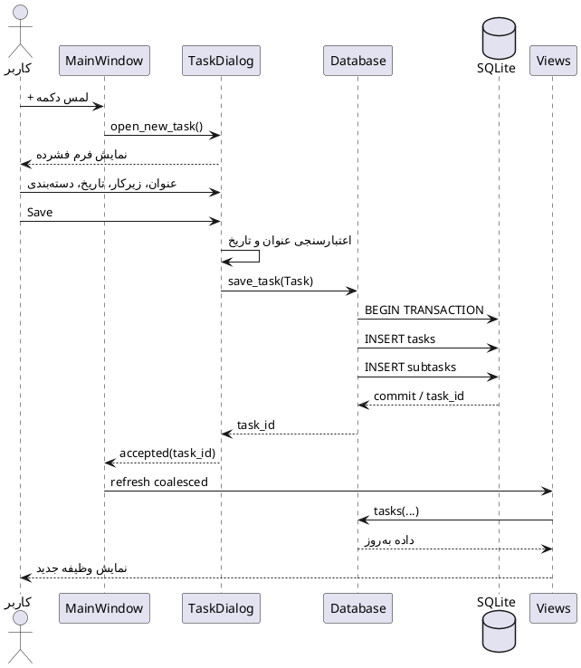
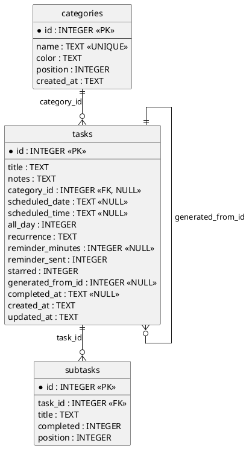

# طراحی و معماری

> **پروژه:** Daymark  
> **نوع محصول:** برنامه مدیریت وظایف و برنامه‌ریزی محلی (Local-first) برای Android  
> **فناوری‌های اصلی:** Python 3.11، PySide6/Qt، SQLite، Buildozer و python-for-android  
> **دامنه فعلی:** تک‌کاربره، بدون حساب ابری و بدون انتقال داده به سرور
> **تیم توسعه:** علی ابراهیمی نیا، امیرحسین رابعی، مهدی ابراهیم زاده، مجتبی محمودی، علی رضا زاده و مهدی نریمانی  
> **شیوه تقسیم کار:** معماری و منطق هسته، رابط کاربری، طراحی UI/UX و پایگاه داده؛ تست، بازبینی و مستندسازی به‌صورت مشترک
> و متناسب با حوزه هر عضو انجام شده است.

## مسئولیت تیم در طراحی و معماری

| حوزه                                         | مسئول اصلی                        | همکاران                   |
|----------------------------------------------|-----------------------------------|---------------------------|
| معماری کلان، مرزبندی ماژول‌ها و منطق دامنه   | علی ابراهیمی نیا                  | تمام اعضای تیم در بازبینی |
| معماری رابط و اتصال Viewها به منطق           | امیرحسین رابعی، مهدی ابراهیم زاده | علی ابراهیمی نیا          |
| طراحی جریان‌ها، Design System و رفتار تعاملی | مجتبی محمودی، مهدی نریمانی        | توسعه‌دهندگان رابط        |
| طرح داده، Repository، تراکنش و Migration     | علی رضا زاده                      | علی ابراهیمی نیا          |

## 1. تصمیم معماری سطح بالا

Daymark یک **Modular Monolith محلی** است. تمام قابلیت‌ها در یک برنامه و یک process اجرا می‌شوند، اما ماژول‌ها بر اساس
مسئولیت جدا شده‌اند. Microservice برای محصول تک‌کاربره و بدون سرور، پیچیدگی غیرضروری ایجاد می‌کند.

معماری منطقی:

1. **Presentation:** پنجره، viewها، dialogها، widgetها، theme و i18n
2. **Application/Domain:** مدل Task، recurrence، calendar و analytics
3. **Persistence/Infrastructure:** SQLite، device adapter، notification و QSettings

## 2. اصول معماری

- UI نباید SQL مستقیم اجرا کند.
- داده دامنه با `Task`، `Subtask` و `Category` جابه‌جا شود.
- عملیات چندمرحله‌ای باید transaction باشد.
- رفتار پلتفرم‌خاص باید در adapter یا branch محدود بماند.
- refreshهای UI باید coalesced باشند تا re-entrant refresh رخ ندهد.
- viewهای مخفی نباید بی‌دلیل rebuild شوند.
- theme باید token-based باشد و رنگ hard-coded پراکنده نداشته باشد.

## 3. نگاشت ماژول‌ها و مالکیت فنی

| ماژول              | مسئولیت                                                  | مسئول اصلی                                                  |
|--------------------|----------------------------------------------------------|-------------------------------------------------------------|
| `main.py`          | startup، exception hook و event guardهای سراسری          | علی ابراهیمی نیا                                            |
| `window.py`        | shell اصلی، navigation، settings و refresh orchestration | مهدی ابراهیم زاده با بازبینی علی ابراهیمی نیا               |
| `views.py`         | Tasks، Planner و History                                 | امیرحسین رابعی و مهدی ابراهیم زاده                          |
| `insights.py`      | نمایش بخش Mine و نمودارها                                | مهدی ابراهیم زاده                                           |
| `dialogs.py`       | New/Edit Task، Schedule، Templates و Category            | امیرحسین رابعی                                              |
| `widgets.py`       | کنترل‌های reusable، swipe card و animation stack         | امیرحسین رابعی و مهدی ابراهیم زاده                          |
| `database.py`      | Repository، schema و migrationهای SQLite                 | علی رضا زاده                                                |
| `models.py`        | مدل‌های دامنه                                            | علی ابراهیمی نیا                                            |
| `recurrence.py`    | محاسبه رخداد بعدی                                        | علی ابراهیمی نیا                                            |
| `analytics.py`     | محاسبات آماری مستقل از UI                                | علی ابراهیمی نیا                                            |
| `theme.py`         | tokenهای رنگ، light/dark و palette                       | توسعه‌دهندگان رابط براساس طراحی مجتبی محمودی و مهدی نریمانی |
| `i18n.py`          | ترجمه انگلیسی و ترکی                                     | توسعه‌دهندگان رابط                                          |
| `device.py`        | تشخیص و رفتارهای Android                                 | علی ابراهیمی نیا و توسعه‌دهندگان رابط                       |
| `notifications.py` | یادآور درون‌برنامه‌ای و رابط توسعه آینده اعلان Android   | علی ابراهیمی نیا                                            |

## 4. نمودار Component

فایل مستقل: [`diagrams/03_component_architecture.puml`](diagrams/03_component_architecture.puml)

## 5. طراحی سطح پایین و کلاس‌ها

مدل `Task` هسته دامنه است. زیرکارها composition هستند و با حذف Task حذف می‌شوند. Category رابطه اختیاری دارد و حذف آن
باید `category_id` وظایف را NULL کند.

فایل مستقل: [`diagrams/04_class_diagram.puml`](diagrams/04_class_diagram.puml)

## 6. Sequence ایجاد وظیفه

نکته مهم این جریان، اعتبارسنجی قبل از write، transaction اتمی و refresh غیرهم‌زمان و coalesced پس از ذخیره است.

فایل مستقل: [`diagrams/05_create_task_sequence.puml`](diagrams/05_create_task_sequence.puml)

## 7. طراحی پایگاه داده

### جدول categories

نام unique و case-insensitive است. `position` ترتیب نمایش را نگه می‌دارد.

### جدول tasks

- `scheduled_date` و `scheduled_time` nullable هستند.
- `completed_at` وضعیت فعال/تکمیل را تعیین می‌کند.
- `generated_from_id` رخداد خودکار recurrence را به مبدأ پیوند می‌دهد.
- `reminder_sent` از اعلان تکراری جلوگیری می‌کند.

### جدول subtasks

رابطه با Task از نوع cascade delete است و `position` ترتیب نمایش را حفظ می‌کند.

فایل مستقل: [`diagrams/06_er_diagram.puml`](diagrams/06_er_diagram.puml)

## 8. Indexها

- `(completed_at, scheduled_date)` برای فهرست فعال/تکمیل و تاریخ
- `(category_id, completed_at)` برای فیلتر دسته‌بندی
- `(task_id, position, id)` برای زیرکارها
- `(generated_from_id)` برای بازیابی recurrence

## 9. الگوهای طراحی

| الگو                  | کاربرد در Daymark                                              |
|-----------------------|----------------------------------------------------------------|
| Repository            | `Database` دسترسی به SQLite را متمرکز می‌کند.                  |
| Adapter               | notification و device behavior را از منطق عمومی جدا می‌کند.    |
| Observer/Signals      | Qt signals برای ارتباط UI و رخدادها استفاده می‌شوند.           |
| Strategy-like         | palette و appearance با token setهای قابل تعویض پیاده می‌شوند. |
| Factory/Builder محدود | ساخت widgetها و task cardها در helperهای متمرکز انجام می‌شود.  |
| Debounce/Coalescing   | timerهای تک‌شات refresh و geometry را ادغام می‌کنند.           |

## 10. تصمیم‌های توسعه‌پذیری

- افزودن backend همگام‌سازی در آینده باید از طریق service جدا انجام شود، نه SQL مستقیم در UI.
- اضافه‌کردن زبان جدید باید فقط به translation catalog و تست پوشش کلیدها نیاز داشته باشد.
- پالت جدید باید تمام roleهای رنگی را تعریف کند و تست contrast داشته باشد.
- notification Android پس‌زمینه باید service بومی و permission flow مستقل داشته باشد.

