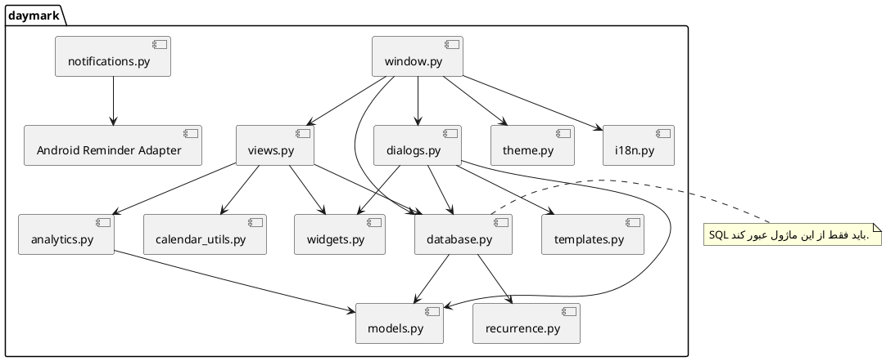

# بهترین رویه‌های پیاده‌سازی

> **پروژه:** Daymark  
> **نوع محصول:** برنامه مدیریت وظایف و برنامه‌ریزی محلی (Local-first) برای Android  
> **فناوری‌های اصلی:** Python 3.11، PySide6/Qt، SQLite، Buildozer و python-for-android  
> **دامنه فعلی:** تک‌کاربره، بدون حساب ابری و بدون انتقال داده به سرور
> **تیم توسعه:** علی ابراهیمی نیا، امیرحسین رابعی، مهدی ابراهیم زاده، مجتبی محمودی، علی رضا زاده و مهدی نریمانی  
> **شیوه تقسیم کار:** معماری و منطق هسته، رابط کاربری، طراحی UI/UX و پایگاه داده؛ تست، بازبینی و مستندسازی به‌صورت مشترک و متناسب با حوزه هر عضو انجام شده است.

## مسئولیت تیم در پیاده‌سازی

| بخش | مسئولان |
|---|---|
| منطق هسته، مدل‌ها، recurrence و analytics | علی ابراهیمی نیا |
| صفحات، dialogها، widgetها و رفتار واکنش‌گرا | امیرحسین رابعی و مهدی ابراهیم زاده |
| انطباق پیاده‌سازی با طراحی، پالت و الگوهای تعامل | مجتبی محمودی و مهدی نریمانی |
| SQLite، Repository، Migration و صحت تراکنش‌ها | علی رضا زاده |
| یکپارچه‌سازی و بازبینی نهایی | علی ابراهیمی نیا با مشارکت مسئول هر بخش |

## 1. استاندارد کدنویسی

- رعایت PEP 8 و formatter ثابت مانند Ruff Format یا Black
- استفاده از type hint برای APIهای عمومی
- استفاده از `dataclass(slots=True)` برای مدل‌های سبک
- نام کلاس `PascalCase`، تابع و متغیر `snake_case` و ثابت `UPPER_CASE`
- خط‌های کوتاه و توابع با یک مسئولیت
- docstring برای منطق غیر بدیهی مانند recurrence، transaction و gesture handling

## 2. مرزهای ماژول

- SQL فقط در `database.py`
- محاسبات آماری فقط در `analytics.py`
- منطق recurrence فقط در `recurrence.py`
- رشته‌های رابط فقط از `i18n.py`
- رنگ رابط فقط از tokenهای `theme.py`
- branchهای Android در کمترین نقاط ممکن



فایل مستقل: [`diagrams/07_package_dependencies.puml`](diagrams/07_package_dependencies.puml)

## 3. خوانایی و ماژولار بودن

هر تابع باید یکی از این نقش‌ها را داشته باشد:

- تبدیل داده
- اجرای use case
- ساخت UI
- واکنش به event
- دسترسی به persistence

تابعی که هم SQL، هم ساخت widget و هم نمایش پیام انجام دهد باید شکسته شود.

## 4. مدیریت خطا

### خطای قابل انتظار

مانند عنوان خالی یا نام دسته تکراری:

- با exception مشخص مانند `ValueError` یا `sqlite3.IntegrityError`
- تبدیل به پیام قابل فهم برای کاربر
- بدون crash و بدون traceback در رابط

### خطای غیرمنتظره

- ثبت traceback در `daymark-crash.log`
- عدم افشای اطلاعات حساس در پیام UI
- بستن امن resourceها
- حفظ transaction rollback

## 5. Transaction و سازگاری داده

```python
with self.connection:
    # تمام writeهای مرتبط
    ...
```

قواعد:

- Task و Subtask باید اتمی ذخیره شوند.
- update یک Task ناموجود باید rollback شود.
- عملیات complete و ساخت رخداد بعدی در یک transaction باشد.
- writeهای ساده مانند تغییر ستاره یا تاریخ نباید کل Task و زیرکارها را rewrite کنند.

## 6. مدیریت چرخه عمر UI

- از nested `QApplication.processEvents()` اجتناب شود.
- dialog فرزند با `try/finally` state خود را آزاد کند.
- timerهای geometry و refresh تک‌شات و coalesced باشند.
- animation نباید widget واقعی فهرست را از layout خارج کند.
- روی Android از screenshot animation سنگین برای کل صفحه استفاده نشود.

## 7. صفحه‌کلید و Back در Android

- Backspace نباید به Back سیستم تبدیل شود.
- رویدادهای کاذب Escape/Back از IME هنگام تایپ consume شوند.
- Back واقعی ابتدا keyboard را ببندد.
- focus تغییر نکند مگر کاربر یا جریان روشن آن را درخواست کند.
- delayed focusهای متعدد ممنوع است، چون keyboard را close/open می‌کند.

## 8. Dependency Management

### Runtime

- Python و PySide6 باید version pin سازگار داشته باشند.
- وابستگی غیرضروری به پروژه افزوده نشود.
- کتابخانه‌ای که wheel Android ندارد بدون بررسی وارد نشود.

### Build

- JDK 17، SDK، NDK و wheelهای Android باید در مستند build pin شوند.
- cacheهای دانلود مانند OpenSSL اعتبارسنجی شوند.
- build script تنها نقطه رسمی ساخت باشد.

## 9. Logging

سطوح پیشنهادی:

- `INFO`: startup، migration، build stage
- `WARNING`: fallback سازگار، config ناقص غیر بحرانی
- `ERROR`: عملیات ناموفق قابل بازیابی
- `CRITICAL`: crash یا خطر ناسازگاری داده

در log نباید متن کامل یادداشت کاربر یا داده شخصی ثبت شود.

## 10. Git و Code Review

### Commit

```text
fix(android): prevent IME back event from reaching exit handler
feat(theme): add aristocratic green palette
refactor(db): update task date without rewriting subtasks
```

### چک‌لیست Review

- آیا مرز ماژول رعایت شده است؟
- آیا write اتمی است؟
- آیا regression test وجود دارد؟
- آیا رفتار برنامه روی نسخه‌ها و اندازه‌های مختلف Android حفظ شده است؟
- آیا رنگ یا متن hard-coded جدید اضافه شده است؟
- آیا event یا timer می‌تواند بعد از نابودی widget اجرا شود؟
- آیا تغییر روی داده نسخه قبلی امن است؟

## پیکربندی اجرایی کیفیت

فایل‌های واقعی زیر به Repository اضافه شده‌اند:

- `pyproject.toml` برای pytest، Coverage، Ruff و mypy
- `requirements-dev.txt` برای ابزارهای توسعه
- `tools/quality_check.py` برای AST، Secret، Artifact، PlantUML و Link Check
- `tools/run_quality_checks.sh` برای اجرای محلی Compile، Test و Coverage
- `.github/workflows/ci.yml` برای اجرای خودکار روی Push و Pull Request

بررسی‌های Full Lint، Bandit، mypy و pip-audit در شروع به‌صورت Advisory هستند تا خطاهای تاریخی ابتدا دسته‌بندی و سپس به Gate مسدودکننده تبدیل شوند.
