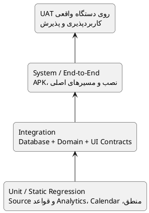

# راهبرد جامع تست

> **پروژه:** Daymark  
> **نوع محصول:** برنامه مدیریت وظایف و برنامه‌ریزی محلی برای Android  
> **فناوری‌های اصلی:** Python 3.11، PySide6/Qt، SQLite، Buildozer و python-for-android  
> **دامنه:** تک‌کاربره، آفلاین، بدون حساب ابری و بدون انتقال داده به سرور  
> **نسخه سند:** 2.0  
> **تاریخ بازبینی:** ۱۴۰۵/۰۵/۰۸ — 2026-07-30

## 1. هدف سند

این سند روش آزمون Daymark را در سطوح Unit، Integration، System، End-to-End و User Acceptance Test تعریف می‌کند. هدف صرفاً اثبات اجرای برنامه نیست؛ بلکه باید صحت منطق وظایف، یکپارچگی SQLite، رفتار رابط لمسی، سازگاری Android، حفظ داده، امنیت محلی، کارایی و کیفیت تجربه کاربر بررسی شود.

اسناد مرتبط:

- [`11_test_cases.md`](11_test_cases.md) — Test Caseهای رسمی
- [`12_test_execution_report.md`](12_test_execution_report.md) — گزارش اجرای واقعی
- [`13_requirements_traceability_matrix.md`](13_requirements_traceability_matrix.md) — ماتریس ردیابی نیازمندی و تست

## 2. مسئولیت اعضای تیم

| حوزه آزمون | مسئول اصلی | بازبین |
|---|---|---|
| منطق دامنه، recurrence و analytics | علی ابراهیمی نیا | علی رضا زاده |
| رابط Tasks، History، فرم‌ها و کنترل‌های لمسی | امیرحسین رابعی | مجتبی محمودی |
| Planner، Settings، Mine، Keyboard و Navigation | مهدی ابراهیم زاده | مهدی نریمانی |
| SQLite، Migration، Transaction و بازیابی داده | علی رضا زاده | علی ابراهیمی نیا |
| کاربردپذیری ثبت و مدیریت وظیفه | مجتبی محمودی | امیرحسین رابعی |
| کاربردپذیری Planner، Theme، Palette و Accessibility | مهدی نریمانی | مهدی ابراهیم زاده |
| یکپارچه‌سازی نتایج و تأیید فنی Release | علی ابراهیمی نیا | تمام اعضای تیم |

## 3. دامنه آزمون

### 3.1 داخل دامنه

- ایجاد، ویرایش، تکمیل، حذف و بازیابی Task
- Subtask، Category، Search و Filter
- Schedule، Reminder و Recurrence
- Day، Week و Month Planner
- History و Mine/Insights
- Language، Theme و Palette
- SQLite، Transaction، Migration و Persistence
- Keyboard، Back، Swipe، Scroll و Lifecycle در Android
- ساخت، نصب، اجرا و بررسی APK ARM64-v8a
- Performance، Security، Privacy و Accessibility

### 3.2 خارج از دامنه نسخه فعلی

- همگام‌سازی Cloud
- حساب کاربری و Authentication
- چندکاربره‌بودن
- Push Notification سمت سرور
- نسخه iOS یا Desktop
- تست انتشار Google Play در نسخه دانشگاهی فعلی

## 4. اصطلاحات وضعیت تست

| وضعیت | تعریف |
|---|---|
| `PASS` | نتیجه واقعی با نتیجه مورد انتظار یکسان است. |
| `FAIL` | حداقل یک انتظار برآورده نشده است. |
| `BLOCKED` | به‌دلیل مانع محیطی یا وابستگی قابل اجرا نیست. |
| `NOT RUN` | هنوز اجرا نشده است. |
| `PARTIAL` | بخشی خودکار یا ایستا تأیید شده، اما بخش دستگاه واقعی باقی مانده است. |

## 5. اولویت و شدت

### اولویت Test Case

| اولویت | تعریف |
|---|---|
| P0 | مسیر حیاتی؛ بدون موفقیت آن Release مجاز نیست. |
| P1 | قابلیت اصلی یا ریسک زیاد؛ باید قبل از Release اجرا شود. |
| P2 | قابلیت مهم اما غیرمسدودکننده. |
| P3 | بهبود، ظاهر یا حالت کم‌تکرار. |

### شدت عیب

| شدت | نمونه |
|---|---|
| Critical | Crash در شروع، ازدست‌رفتن داده، APK غیرقابل نصب |
| High | ناتوانی در ایجاد/تکمیل Task، خرابی Migration، خروج ناخواسته با Back |
| Medium | مشکل یک View، ناسازگاری Palette، رفتار اشتباه Filter |
| Low | فاصله، متن، Tooltip یا نقص بصری جزئی |

## 6. هرم تست



فایل مستقل: [`diagrams/08_test_strategy.puml`](diagrams/08_test_strategy.puml)

## 7. محیط‌های آزمون

### 7.1 محیط خودکار

- سیستم عامل اجرای بررسی فعلی: Linux AMD64
- Python اجرای بررسی فعلی: 3.13.5
- pytest: 9.0.2
- Coverage.py: 7.13.3
- Database: SQLite موقت برای هر Test
- کد هدف پروژه: Python 3.11

> اجرای ثبت‌شده در گزارش فعلی با Python 3.13.5 انجام شده است. پیش از Release نهایی باید همین مجموعه در محیط رسمی Python 3.11 پروژه نیز اجرا شود.

### 7.2 محیط دستگاه واقعی

برای هر اجرای UAT باید این اطلاعات ثبت شود:

- سازنده و مدل گوشی
- نسخه Android
- اندازه و رزولوشن نمایشگر
- زبان سیستم
- نسخه Build و Commit
- وضعیت نصب تمیز یا ارتقا
- نوع Keyboard
- نتیجه و Evidence

## 8. معیار ورود به تست

آغاز Test Cycle زمانی مجاز است که:

- کد مربوط به Cycle Commit شده باشد.
- وابستگی‌ها نصب شوند.
- اجرای برنامه یا Import ماژول‌های هدف ممکن باشد.
- Database آزمایشی مستقل از داده واقعی باشد.
- نیازمندی و معیار پذیرش قابلیت مشخص باشد.
- Test Data و محیط آزمون آماده باشد.
- برای تست دستگاه، APK مربوط به همان Commit در دسترس باشد.

## 9. تست واحد و خودکار

موارد اصلی:

- `next_date` برای daily، weekdays، weekly و monthly
- پایان ماه و سال کبیسه
- `Task.is_overdue`
- parsing و formatting تاریخ و ساعت
- completion streak و completion rate
- analytics و heatmap
- validation عنوان و Category
- Palette roles و Contrast
- Calendar conversion
- Responsive layout decision
- Regressionهای source-level برای geometry، animation و refresh

دستور استاندارد:

```bash
PYTHONPATH=. python -m pytest -q
```

دستور Coverage:

```bash
PYTHONPATH=. python -m coverage run --source=daymark -m pytest -q
python -m coverage report -m
```

## 10. تست یکپارچه‌سازی

### Database + Domain

- ذخیره Task همراه Subtask
- Edit بدون حذف ناخواسته Subtask
- Complete و ایجاد رخداد بعدی
- Idempotency در Complete
- Restore و حذف فقط رخداد Generated متناظر
- Search در Title، Notes و Subtask
- حذف Category و `NULL` شدن `category_id`
- Migration از Schema قبلی
- Rollback در خطای Write
- Persistence پس از Restart

### UI Contracts و Static Regression

- نبود `QApplication.processEvents()` تو در تو
- Coalesced refresh و geometry update
- Vertical-only scroller
- مخفی‌بودن Swipe Action در حالت بسته
- Guardهای Keyboard/Back
- جلوگیری از Snapshot پرهزینه در Android
- استفاده از Position Animation به‌جای Geometry Animation
- کنترل Width برای Schedule refit

## 11. تست سیستم و End-to-End

مسیرهای حیاتی:

1. نصب تمیز و اجرای اول
2. ایجاد Task ساده
3. ایجاد Task دارای Subtask، Note، Category، Date و Recurrence
4. Edit و مشاهده حفظ داده
5. Complete، History و Restore
6. Search و Category Filter
7. Day، Week و Month Planner
8. Swipe Star، Date و Delete
9. تغییر Language، Theme و Palette و Restart
10. ارتقا از APK قبلی و حفظ SQLite

## 12. UAT روی Android واقعی

| حوزه | سناریوی پذیرش |
|---|---|
| Keyboard | شروع تایپ، مکث، ادامه تایپ و دسترسی به Save |
| Back | بستن Keyboard، سپس Dialog و سپس Navigation |
| Schedule | نبود Scroll افقی، Jump و Clipping |
| Swipe | Axis Lock، Actionهای مخفی و Delete امن |
| Scroll | فهرست طولانی در Tasks، Planner، History و Mine |
| Theme | سه Palette در حالت Light و Dark |
| Lifecycle | Background، Foreground، Kill و Relaunch |
| Data | حفظ Task، Category، Settings و History |
| Accessibility | Contrast، Target Size و خوانایی |
| UX | انجام مسیر اصلی بدون راهنمای مستقیم آزمایش‌کننده |

## 13. داده‌های آزمون

حداقل مجموعه داده:

- Task بدون Date
- Task دارای Date و All-day
- Task دارای Date، Time و Reminder
- Task دارای ۰، ۱ و چند Subtask
- Daily، Weekdays، Weekly و Monthly Recurrence
- تاریخ‌های 29، 30 و 31 ماه
- Title خالی، Space-only، Long و Unicode
- متن فارسی، ترکی، انگلیسی و Emoji
- Category تکراری و Category دارای Task
- 500 Task و 1000 Subtask برای Performance

## 14. تست‌های منفی و مرزی

- رد Title خالی یا فقط Space
- جلوگیری از ثبت چندباره با Tap سریع
- Monthly recurrence برای روزهای انتهای ماه
- Update شناسه ناموجود و Rollback کامل
- حذف Category بدون حذف Task
- Characterهای `'`، `%`، Emoji و Unicode در ورودی
- داده خراب یا Migration ناموفق
- Back هنگام بازبودن Keyboard
- تغییر Theme هنگام بازبودن Dialog
- Kill برنامه در عملیات نوشتن
- Clear Date و پاک‌شدن Time، Reminder و Recurrence وابسته

## 15. تست کارایی

### بار آزمون

- 500 Task
- 1000 Subtask
- چند Category
- ترکیب Taskهای Active و Completed

### شاخص‌ها

- زمان نمایش صفحه اصلی
- زمان Query فهرست Active
- زمان Search
- زمان Complete و Refresh
- Memory هنگام جابه‌جایی Viewها
- Frame pacing در Scroll و Animation
- تعداد Refresh در هر Event

### معیار پذیرش

- Freeze قابل مشاهده بالاتر از ۱ ثانیه در عملیات عادی وجود نداشته باشد.
- عملیات محلی رایج حداکثر در حدود 300 میلی‌ثانیه بازخورد اولیه بدهند.
- Crash یا ANR در آزمون تعامل مداوم ۳۰ دقیقه‌ای صفر باشد.
- Scroll با داده حجیم قابل استفاده باقی بماند.

## 16. تست امنیت و حریم خصوصی

- استفاده از SQL پارامتری
- Rollback کامل در خطای Write
- نبود Subtask orphan
- نبود Network Call ناخواسته
- ذخیره در فضای خصوصی برنامه
- بررسی فایل APK و معماری آن
- بررسی امضای Build انتشار
- عدم قرارگیری Key، Token، Database و Log خصوصی در Repository

## 17. تست دسترس‌پذیری

- Contrast متن اصلی حداقل 4.5:1
- اندازه کنترل‌های اصلی حدود 44 تا 48 پیکسل منطقی
- انتقال‌ندادن اطلاعات فقط با رنگ
- برچسب معنادار برای کنترل‌ها
- خوانایی Light/Dark
- عدم بریده‌شدن متن در اندازه‌های مختلف
- بررسی English و Turkish

## 18. ردیابی نیازمندی‌ها

هر Test Case باید حداقل یک FR یا NFR داشته باشد. ماتریس کامل در سند زیر نگهداری می‌شود:

[`13_requirements_traceability_matrix.md`](13_requirements_traceability_matrix.md)

تغییر Requirement بدون اصلاح Test Case متناظر ناقص محسوب می‌شود.

## 19. Coverage

### هدف

- هسته غیرگرافیکی: حداقل 90% با Branch Coverage
- کل UI: Line Coverage معیار اصلی نیست؛ Contract Test، Static Regression و UAT لازم است.

### نتیجه ثبت‌شده فعلی

- 42 Test خودکار: `PASS`
- Coverage هسته غیرگرافیکی با Branch Coverage: `92%`
- Coverage کل Package با احتساب UIهای اجرا‌نشده: `9%`

هدف Core محقق شده است؛ UI همچنان با Contract Test، Static Regression و UAT دستگاه واقعی ارزیابی می‌شود.

## 20. مدیریت عیب

هر Defect باید شامل این موارد باشد:

- Defect ID
- عنوان
- Build و Commit
- دستگاه و Android
- پیش‌شرط
- مراحل بازتولید
- Expected Result
- Actual Result
- Severity و Priority
- Screenshot یا Log
- مسئول رفع
- Test Case Regression
- وضعیت

هیچ عیب Critical یا High بدون Test Regression یا Checklist ثبت‌شده بسته نمی‌شود.

## 21. معیار خروج از Test Cycle

Release زمانی از نظر تست قابل قبول است که:

- تمام Test Caseهای P0 اجرا و PASS شده باشند.
- هیچ Defect با شدت Critical یا High باز نباشد.
- تمام مسیرهای CRUD و Persistence PASS باشند.
- Migration و حفظ داده روی ارتقای APK تأیید شده باشد.
- APK روی حداقل یک دستگاه واقعی نصب و اجرا شده باشد.
- Keyboard، Back، Schedule، Swipe و Lifecycle بررسی شده باشند.
- نرخ قبولی Test Caseهای اجراشده حداقل 95% باشد.
- Core Coverage حداقل 90% باقی بماند.
- Defectهای Medium باقی‌مانده ثبت و Risk آنها پذیرفته شده باشد.
- گزارش اجرای تست تکمیل و امضا شده باشد.

## 22. تصمیم فعلی Release

براساس اجرای خودکار، 42 تست پاس و Core Coverage با Branch Coverage برابر 92% است. وضعیت کلی همچنان به‌دلیل اجرا‌نشدن کامل UATهای دستگاه واقعی **مشروط** است و نباید به‌عنوان «تمام تست‌های Android پاس شده‌اند» گزارش شود.
