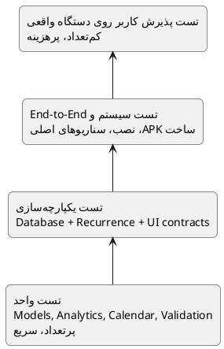

# راهبرد تست

> **پروژه:** Daymark  
> **نوع محصول:** برنامه مدیریت وظایف و برنامه‌ریزی محلی (Local-first) برای Android  
> **فناوری‌های اصلی:** Python 3.11، PySide6/Qt، SQLite، Buildozer و python-for-android  
> **دامنه فعلی:** تک‌کاربره، بدون حساب ابری و بدون انتقال داده به سرور
> **تیم توسعه:** علی ابراهیمی نیا، امیرحسین رابعی، مهدی ابراهیم زاده، مجتبی محمودی، علی رضا زاده و مهدی نریمانی  
> **شیوه تقسیم کار:** معماری و منطق هسته، رابط کاربری، طراحی UI/UX و پایگاه داده؛ تست، بازبینی و مستندسازی به‌صورت مشترک
> و متناسب با حوزه هر عضو انجام شده است.

## مسئولیت تیم در تست

| حوزه آزمون                                             | مسئولان اصلی      |
|--------------------------------------------------------|-------------------|
| تست منطق دامنه، recurrence و analytics                 | علی ابراهیمی نیا  |
| تست رابط Tasks، History، فرم‌ها و کنترل‌های لمسی       | امیرحسین رابعی    |
| تست Planner، Settings، Mine، keyboard و navigation     | مهدی ابراهیم زاده |
| تست پایگاه داده، migration، transaction و بازیابی داده | علی رضا زاده      |
| آزمون کاربردپذیری جریان ثبت و مدیریت وظایف             | مجتبی محمودی      |
| آزمون کاربردپذیری Planner، تم، پالت و دسترس‌پذیری      | مهدی نریمانی      |

پذیرش نسخه نهایی با اجرای سناریوهای مشترک روی دستگاه Android انجام شده است.

## 1. هدف

تست Daymark باید علاوه بر منطق دامنه، خطاهای خاص رابط لمسی، صفحه‌کلید Android، geometry، build و مهاجرت داده را پوشش
دهد. اتکا به تست دستی کافی نیست، ولی تست GUI صرفاً خودکار نیز رفتار دستگاه واقعی را کامل بازنمایی نمی‌کند.

## 2. هرم تست

فایل مستقل: [`diagrams/08_test_strategy.puml`](diagrams/08_test_strategy.puml)

## 3. تست واحد

موارد اصلی:

- `next_date` برای daily، weekday، weekly و monthly
- `Task.is_overdue`
- parsing تاریخ و ساعت
- completion streak
- completion rate، heatmap و category counts
- validation عنوان و نام دسته‌بندی
- انتخاب palette و completeness نقش‌های رنگی
- calendar month calculations

هدف پوشش:

- منطق دامنه و پایگاه داده: حداقل ۸۵٪
- UI rendering: پوشش خطی معیار اصلی نیست؛ تست contract و smoke مهم‌تر است.

## 4. تست یکپارچه‌سازی

### Database + Domain

- ذخیره Task همراه Subtask
- complete و ایجاد رخداد بعدی
- restore و حذف فقط رخداد generated
- جست‌وجو در title، notes و subtask
- حذف category و NULL شدن category_id
- migration از schema قبلی
- rollback در خطای write

### UI Contract

این تست‌ها می‌توانند source-level یا Qt test باشند:

- نبود nested process events
- coalesced refresh timer
- vertical-only schedule scroller
- عدم نمایش actionهای swipe در حالت بسته
- وجود guard برای keyboard/back
- ثابت‌بودن ارتفاع تقویم شش‌ردیفه

## 5. تست سیستم و End-to-End

سناریوهای ضروری:

1. نصب تمیز و اجرای اول
2. ایجاد وظیفه بدون تاریخ
3. ایجاد وظیفه دارای زیرکار، یادداشت، دسته و recurrence
4. انتخاب تاریخ از quick action و تقویم
5. تکمیل و بازیابی recurring task
6. تغییر palette و restart
7. جست‌وجو و فیلتر category
8. مشاهده Day/Week/Month
9. حذف category بدون حذف Task
10. ارتقا از APK قبلی با حفظ SQLite

## 6. UAT روی Android واقعی

ماتریس حداقل:

| حوزه      | سناریو                                                          |
|-----------|-----------------------------------------------------------------|
| Keyboard  | شروع تایپ، مکث، ادامه تایپ، تغییر title/subtask/notes           |
| Back      | بستن keyboard، dialog و سپس navigation                          |
| Schedule  | نبود scroll افقی، نبود hop و نبود clipping                      |
| Swipe     | پنهان‌بودن actionها، axis lock و delete امن                     |
| Scroll    | فهرست طولانی در Tasks، Planner، History و Mine                  |
| Theme     | سه palette در روشن و تاریک                                      |
| Lifecycle | background/foreground، rotation در صورت پشتیبانی، kill/relaunch |
| Data      | restart و حفظ Task/Category/Settings                            |

## 7. تست کارایی

- Seed با ۵۰۰ Task و ۱۰۰۰ Subtask
- زمان query فهرست فعال
- زمان refresh پس از تکمیل
- تعداد refresh در یک تغییر
- مصرف حافظه هنگام رفت‌وبرگشت بین بخش‌ها
- frame pacing در scroll و animation

معیار پیشنهادی:

- هیچ freeze قابل مشاهده بالاتر از ۱ ثانیه در عملیات عادی
- refresh مستقیم تکراری در یک event ممنوع
- crash یا ANR در تست ۳۰ دقیقه‌ای تعامل مداوم صفر

## 8. تست امنیت

- عنوان و یادداشت با `'`, `%`, Unicode و متن طولانی
- نام دسته‌بندی تکراری با تفاوت حروف
- بررسی parameterized SQL
- بررسی نبود network call ناخواسته
- dependency audit
- بررسی فایل APK و امضا

## 9. TDD یا Test-after

روش پیشنهادی **ترکیبی** است:

- برای recurrence، analytics، migration و bug regression: ابتدا تست یا حداقل تست هم‌زمان با fix
- برای prototype بصری: پیاده‌سازی اولیه سپس contract test و UAT
- هیچ bug بحرانی بدون regression test بسته نشود، مگر رفتار صرفاً وابسته به device باشد؛ در آن حالت checklist و log
  اجباری است.

## 10. نمونه Test Case

### TC-SCH-03: انتخاب تاریخ بدون پرش

- **پیش‌شرط:** New Task باز و Schedule نمایش داده شده است.
- **گام‌ها:** Today، Tomorrow، تاریخ تقویم و No date را به‌ترتیب انتخاب کنید.
- **انتظار:** scroll position تغییر ناخواسته نکند، صفحه افقی حرکت نکند و کنترل Repeat کامل دیده شود.

### TC-IME-02: ادامه تایپ بعد از مکث

- **گام‌ها:** در title تایپ کنید، ۵ ثانیه مکث کنید و دوباره تایپ کنید.
- **انتظار:** پیام «press again to exit» ظاهر نشود و keyboard بسته/باز نشود.

