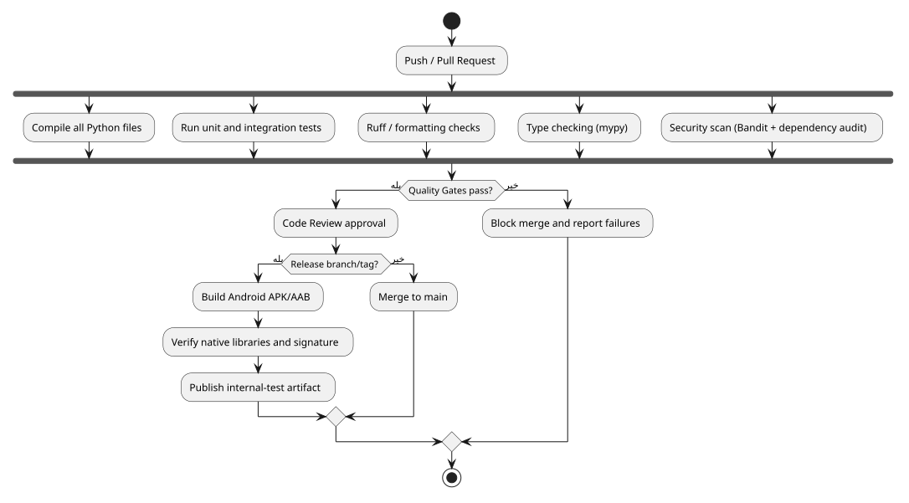
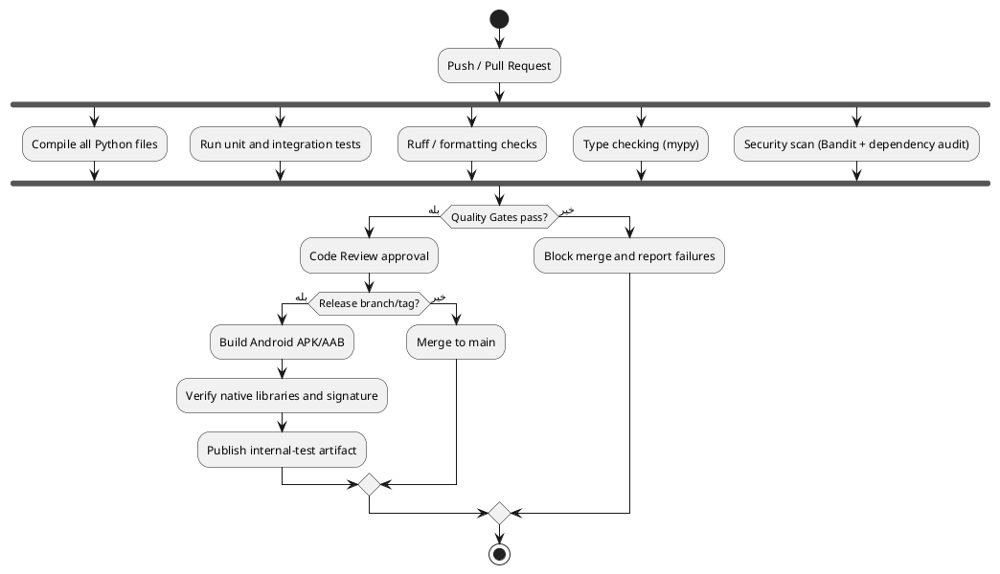

<div dir="rtl">

# تضمین کیفیت و کیفیت کد

> **پروژه:** Daymark  
> **نوع محصول:** برنامه مدیریت وظایف و برنامه‌ریزی محلی (Local-first) برای Android  
> **فناوری‌های اصلی:** Python 3.11، PySide6/Qt، SQLite، Buildozer و python-for-android  
> **دامنه فعلی:** تک‌کاربره، بدون حساب ابری و بدون انتقال داده به سرور

## 1. هدف QA

QA فقط اجرای تست در پایان نیست. کیفیت باید از تعریف نیاز، طراحی، کدنویسی، بازبینی، build و انتشار کنترل شود.

## 2. تحلیل ایستا

ابزارهای پیشنهادی:

| ابزار           | هدف                        |
|-----------------|----------------------------|
| Ruff            | lint، import و formatting  |
| mypy            | کنترل type contractهای مهم |
| Bandit          | یافتن الگوهای ناامن Python |
| pip-audit       | آسیب‌پذیری dependencyها    |
| pytest/unittest | اجرای تست‌ها               |
| ShellCheck      | بررسی اسکریپت‌های shell    |
| PlantUML CI     | بررسی parseشدن نمودارها    |

پیکربندی باید در repository ذخیره شود تا خروجی محلی و CI یکسان باشد.

## 3. Continuous Integration

<p align="center">
  
</p>

<p align="center"><em>جریان کنترل کیفیت، بازبینی و ساخت خروجی انتشار</em></p>

### کد منبع PlantUML



فایل مستقل: [`diagrams/09_ci_quality.puml`](diagrams/09_ci_quality.puml)

## 4. Quality Gates

Pull Request فقط در صورت تحقق همه موارد قابل merge است:

- compile تمام فایل‌های Python
- پاس‌شدن تست‌ها
- عدم خطای lint سطح error
- عدم آسیب‌پذیری بحرانی شناخته‌شده
- review تأییدشده
- مستندشدن تغییر رفتار
- برای تغییر Android: شواهد device test یا توضیح عدم نیاز

## 5. Code Review اجباری

Reviewer باید بیشتر از style بررسی کند:

- race/re-entrancy eventها
- اجرای timer پس از destroy شدن widget
- transaction و rollback
- migration و سازگاری نسخه قبل
- focus/keyboard/back در Android
- viewport width و scroll policy
- hard-coded color/string
- هزینه rebuild و animation

## 6. طبقه‌بندی عیب

| شدت      | تعریف                                  | نمونه                            |
|----------|----------------------------------------|----------------------------------|
| Critical | crash، از دست رفتن داده، build غیرممکن | crash هنگام افزودن Task از Month |
| High     | مسیر اصلی مسدود یا خروج ناخواسته       | پیام خروج هنگام تایپ             |
| Medium   | عملکرد موجود ولی UX معیوب              | scroll افقی Schedule             |
| Low      | نقص بصری محدود                         | clipping چند پیکسل سال heatmap   |

SLA داخلی پیشنهادی:

- Critical: اصلاح یا rollback فوری
- High: قبل از release بعدی
- Medium: Sprint جاری یا بعدی
- Low: backlog طراحی

## 7. معیارهای کیفیت

- نرخ crash در تست داخلی
- تعداد regressionها در هر release
- زمان متوسط build
- زمان query و refresh
- درصد PRهای دارای تست
- تعداد warningهای lint/type
- نرخ پذیرش UAT در اولین build

## 8. مدیریت نسخه

Semantic Versioning پیشنهادی:

```text
MAJOR.MINOR.PATCH
```

- MAJOR: تغییر ناسازگار داده یا رفتار اصلی
- MINOR: قابلیت جدید سازگار
- PATCH: bug fix

برای Android باید `versionName` و `versionCode` هر دو مدیریت شوند.

## 9. Release Readiness Checklist

- migration روی کپی داده واقعی تست شده است.
- install و upgrade هر دو پاس شده‌اند.
- icon، label، package ID و permissionها بررسی شده‌اند.
- debug flag و log حساس در release وجود ندارد.
- release با keystore درست امضا شده است.
- UAT روی حداقل یک Samsung ARM64 پاس شده است.

</div>