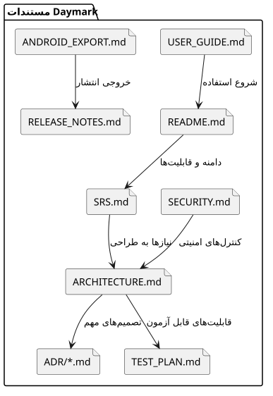
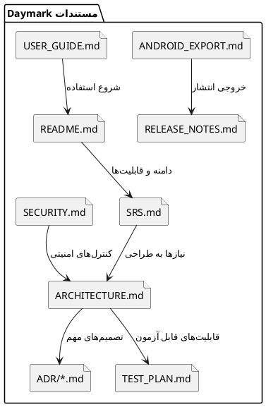

<div dir="rtl">

# برنامه مستندسازی

> **پروژه:** Daymark  
> **نوع محصول:** برنامه مدیریت وظایف و برنامه‌ریزی محلی (Local-first) برای Android  
> **فناوری‌های اصلی:** Python 3.11، PySide6/Qt، SQLite، Buildozer و python-for-android  
> **دامنه فعلی:** تک‌کاربره، بدون حساب ابری و بدون انتقال داده به سرور

## 1. اصول

- مستند باید همراه کد تغییر کند.
- منبع حقیقت برای رفتار محصول SRS و تست پذیرش است.
- تصمیم معماری مهم باید ADR داشته باشد.
- دستور build باید از ابتدا تا انتها قابل اجرا باشد.
- screenshot به‌تنهایی جای توضیح رفتار و معیار پذیرش را نمی‌گیرد.

## 2. نقشه مستندات

<p align="center">
  
</p>

<p align="center"><em>ارتباط اسناد اصلی پروژه Daymark</em></p>

### کد منبع PlantUML



فایل مستقل: [`diagrams/10_documentation_map.puml`](diagrams/10_documentation_map.puml)

## 3. SRS

باید شامل این موارد باشد:

- هدف، دامنه و ذی‌نفعان
- functional و non-functional requirements
- فرض‌ها و محدودیت‌ها
- user story و use case
- معیار پذیرش
- traceability به test case

سند `01_requirements_engineering.md` پایه SRS پروژه است.

## 4. Design Document

باید موارد زیر را نگه دارد:

- معماری سطح بالا
- مرز ماژول‌ها
- component، class، sequence و ER diagram
- تصمیم‌های performance و platform
- schema و migration strategy
- failure modes

## 5. API Documentation

Daymark در نسخه فعلی REST API ندارد؛ بنابراین Swagger/OpenAPI کاربرد مستقیم ندارد. مستند API فعلی شامل این موارد است:

- docstring کلاس‌ها و توابع عمومی
- contract متدهای `Database`
- model fieldها
- Qt signalها و callbackهای مهم

اگر cloud sync اضافه شد، OpenAPI برای endpointها اجباری خواهد بود.

## 6. README کاربر و توسعه‌دهنده

### README کاربر

- معرفی کوتاه
- قابلیت‌ها
- نصب و شروع
- محل داده و حریم خصوصی
- محدودیت اعلان Android

### راهنمای توسعه‌دهنده

- نسخه Python
- ساخت venv
- اجرای تست
- ساخت، امضا و نصب APK/AAB اندروید
- ساختار پوشه
- روش عیب‌یابی log

## 7. ADR

نام‌گذاری:

```text
ADR-0001-local-first-sqlite.md
ADR-0002-pyside6-cross-platform.md
ADR-0003-modular-monolith.md
ADR-0004-theme-token-system.md
```

قالب:

```markdown
# عنوان تصمیم

## وضعیت

Accepted / Superseded / Deprecated

## زمینه

مسئله و محدودیت‌ها

## تصمیم

انتخاب انجام‌شده

## پیامدها

مزایا، هزینه‌ها و ریسک‌ها
```

## 8. Release Notes

برای هر نسخه:

- قابلیت‌های جدید
- رفع باگ
- تغییر migration
- محدودیت شناخته‌شده
- دستور upgrade خاص
- hash یا نام artifact

## 9. نگهداری مستندات

مالک هر سند مشخص باشد. در Definition of Done، تغییر رفتار بدون تغییر مستند ناقص محسوب شود. لینک‌های شکسته و PlantUMLها
در CI بررسی شوند.

</div>