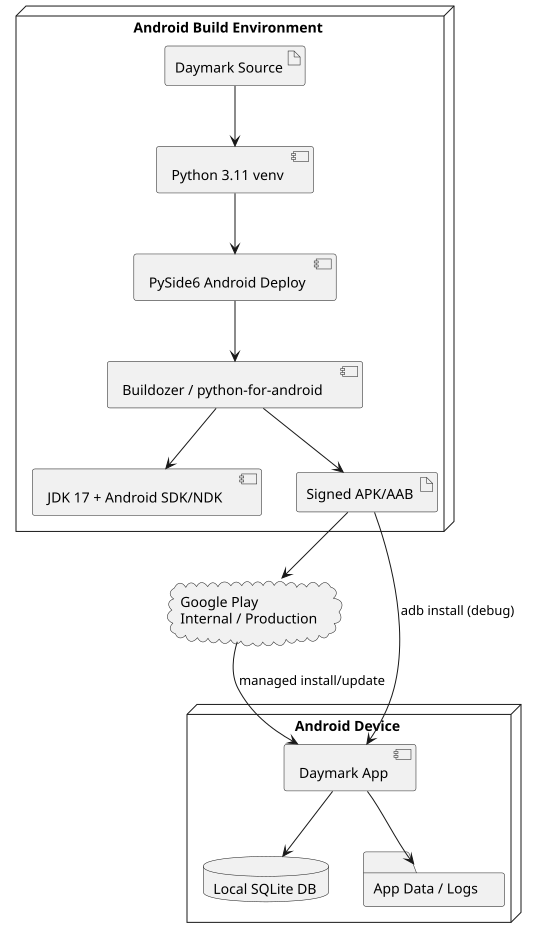
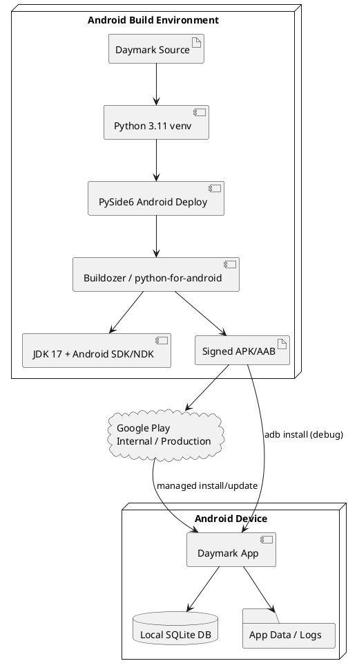
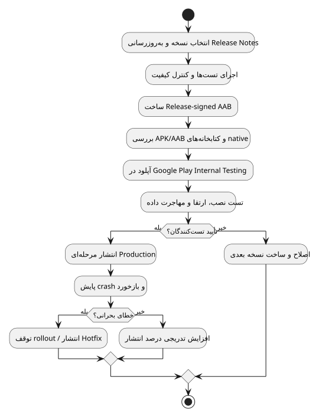
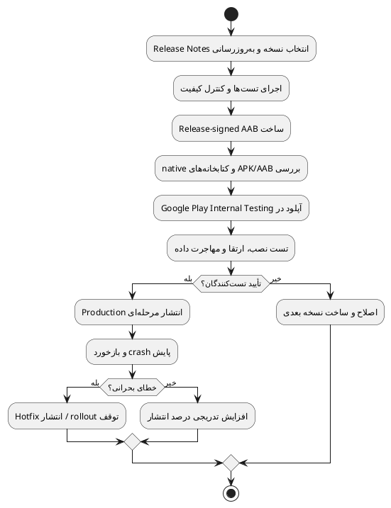

# استقرار و DevOps

> **پروژه:** Daymark  
> **نوع محصول:** برنامه مدیریت وظایف و برنامه‌ریزی محلی (Local-first) برای Android  
> **فناوری‌های اصلی:** Python 3.11، PySide6/Qt، SQLite، Buildozer و python-for-android  
> **دامنه فعلی:** تک‌کاربره، بدون حساب ابری و بدون انتقال داده به سرور

## 1. مدل استقرار

Daymark سرویس ابری ندارد. استقرار به معنی تولید، امضا، آزمون و انتشار بسته Android است:

- APK برای نصب و آزمون مستقیم روی دستگاه
- AAB امضاشده برای انتشار از طریق Google Play

## 2. زنجیره ساخت Android

اجزای اصلی:

- محیط ساخت کنترل‌شده Android یا CI runner
- Python 3.11 virtual environment
- PySide6/Shiboken6 Android wheels
- `pyside6-android-deploy`
- Buildozer و python-for-android
- JDK 17
- Android SDK و NDK
- cache معتبر OpenSSL
- APK verifier

قانون پروژه: ساخت فقط از طریق `./build_android.sh` انجام شود، نه اجرای مستقیم Buildozer.

## 3. نمودار استقرار

  

<em>زنجیره ساخت و استقرار Daymark روی Android</em>

### کد منبع PlantUML

فایل مستقل: [`diagrams/11_deployment.puml`](diagrams/11_deployment.puml)

## 4. محیط‌ها

| محیط             | هدف                                  |
|------------------|--------------------------------------|
| Development / CI | compile، lint و اجرای تست‌های خودکار |
| Android Debug    | نصب با adb روی دستگاه توسعه          |
| Internal Testing | build امضاشده برای گروه محدود        |
| Production       | انتشار مرحله‌ای از Google Play       |

## 5. CI/CD پیشنهادی

CI می‌تواند compile، test، lint و تولید artifact را انجام دهد. ساخت Android باید روی runner کنترل‌شده‌ای انجام شود که
Python 3.11، JDK 17، Android SDK/NDK، PySide6 Android wheels و کلیدهای امضای محافظت‌شده را در اختیار دارد.

  

<em>فرایند آماده‌سازی، آزمون و انتشار نسخه</em>

### کد منبع PlantUML

فایل مستقل: [`diagrams/12_release_pipeline.puml`](diagrams/12_release_pipeline.puml)

## 6. امضا و انتشار

- debug APK فقط برای توسعه است.
- هشدار Play Protect برای APK ناشناخته sideloadشده طبیعی است و با کد UI حذف نمی‌شود.
- release باید با keystore امن امضا شود.
- keystore و password نباید داخل repository باشند.
- برای Google Play، AAB و Play App Signing توصیه می‌شود.

## 7. نسخه‌بندی و مهاجرت

قبل از انتشار:

- `versionCode` افزایش یابد.
- migration روی دیتابیس نسخه قبلی تست شود.
- downgrade پشتیبانی نمی‌شود مگر صریحاً طراحی شود.
- backup آزمایشی از DB قبل از migration پرریسک تهیه شود.

## 8. Monitoring و Logging

چون backend وجود ندارد، monitoring فعلی محلی است:

- `daymark-crash.log`
- `adb logcat`
- build log در `dist-android/build.log`
- verifier خروجی APK

برای نسخه store می‌توان crash reporting opt-in و privacy-preserving اضافه کرد؛ ارسال خودکار بدون رضایت مناسب نیست.

## 9. Runbook خطای Build

1. اولین `ERROR` واقعی قبل از wrapper نهایی پیدا شود.
2. نسخه JDK، SDK، NDK و Python ثبت شود.
3. `.buildozer` بی‌دلیل حذف نشود.
4. مشکل download با cache معتبر حل شود، نه retry بی‌پایان.
5. پس از build، وجود libraryهای ABI و APK بررسی شود.

## 10. Runbook crash Android

1. app data و سناریوی بازتولید ثبت شود.
2. `capture_android_log.sh` اجرا شود.
3. اولین Python traceback یا native fatal پیدا شود.
4. fix با regression test یا device checklist همراه شود.
5. نصب upgrade روی همان داده مجدداً تست شود.

