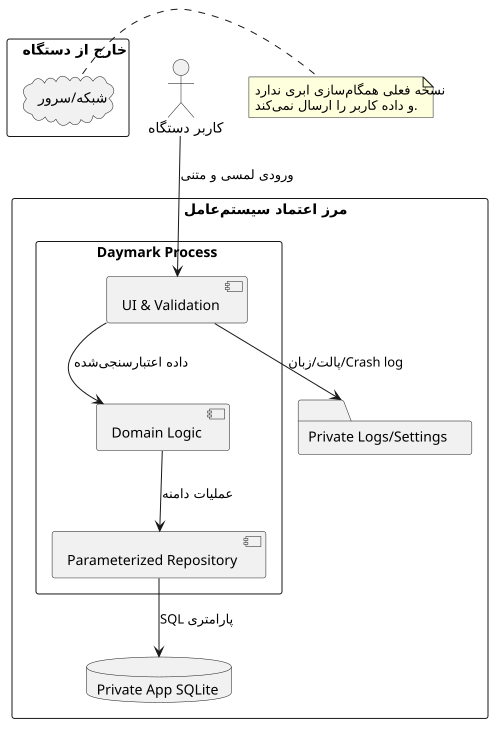
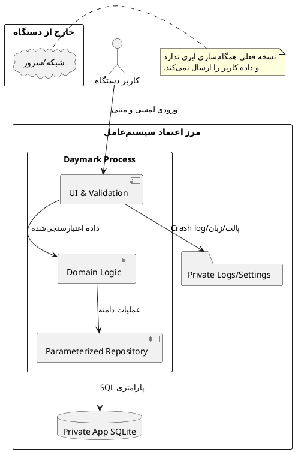

# امنیت، حریم خصوصی، دسترس‌پذیری و اخلاق

> **پروژه:** Daymark  
> **نوع محصول:** برنامه مدیریت وظایف و برنامه‌ریزی محلی (Local-first) برای Android  
> **فناوری‌های اصلی:** Python 3.11، PySide6/Qt، SQLite، Buildozer و python-for-android  
> **دامنه فعلی:** تک‌کاربره، بدون حساب ابری و بدون انتقال داده به سرور

## 1. مدل تهدید

دارایی‌های اصلی:

- عنوان و یادداشت وظایف
- تاریخ‌ها، عادت‌ها و اطلاعات رفتاری
- دسته‌بندی‌ها و آمار عملکرد
- تنظیمات زبان، ظاهر و پالت

تهدیدهای اصلی:

- دسترسی فرد دیگر به دستگاه باز
- استخراج داده از backup یا دستگاه rootشده
- SQL injection از ورودی متن
- خراب‌شدن داده بر اثر write ناقص
- APK دستکاری‌شده یا امضانشده
- log شامل محتوای خصوصی

## 2. مرز اعتماد

  

<em>مرزهای اعتماد، داده محلی و کنترل‌های امنیتی Daymark</em>

### کد منبع PlantUML

فایل مستقل: [`diagrams/13_security_boundary.puml`](diagrams/13_security_boundary.puml)

## 3. Authentication و Authorization

در نسخه فعلی Daymark حساب کاربری و سرور ندارد؛ بنابراین authentication درون‌برنامه‌ای نیاز عملکردی نیست. کنترل دسترسی به
عهده قفل دستگاه و sandbox سیستم‌عامل است.

این موضوع باید صریح باشد:

- نبود login به معنی نبود امنیت نیست؛ مدل اعتماد، مالک دستگاه است.
- افزودن cloud sync در آینده بدون OAuth/OIDC، token rotation و authorization مجاز نیست.
- قفل اختیاری برنامه با biometrics می‌تواند قابلیت آینده باشد.

## 4. Input Validation

- title بعد از trim نباید خالی باشد.
- نام category نباید خالی یا تکراری باشد.
- year باید چهاررقمی و در بازه منطقی باشد.
- recurrence فقط از enum/گزینه شناخته‌شده پذیرفته شود.
- color فقط فرمت معتبر hex داشته باشد.
- طول title و notes بهتر است محدودیت منطقی داشته باشد تا DoS محلی و UI overflow رخ ندهد.

## 5. OWASP و آسیب‌پذیری‌های رایج

با وجود نبود وب، اصول زیر مرتبط‌اند:

- **Injection:** تمام SQLها پارامتری باشند.
- **Insecure Design:** transaction و migration از ابتدا طراحی شوند.
- **Security Misconfiguration:** debug flag و test key در release نباشد.
- **Vulnerable Components:** dependency audit منظم انجام شود.
- **Logging Failures:** crash ثبت شود ولی داده شخصی log نشود.
- **Software Integrity:** artifact امضا و hash آن ثبت شود.

## 6. حریم خصوصی و GDPR awareness

Daymark local-first مزیت مهمی دارد:

- داده وظایف به server ارسال نمی‌شود.
- analytics بخش Mine روی دستگاه محاسبه می‌شود.
- account profile وجود ندارد.

الزامات پیشنهادی:

- Privacy Notice کوتاه و روشن
- توضیح محل ذخیره و اثر uninstall
- قابلیت حذف کامل داده
- رضایت صریح قبل از هر telemetry آینده
- data minimization؛ فقط داده لازم ذخیره شود

## 7. Encryption

SQLite فعلی به‌صورت پیش‌فرض رمزگذاری‌شده نیست، ولی در sandbox خصوصی سیستم‌عامل قرار دارد. برای تهدید بالاتر:

- استفاده از encryption at rest مانند SQLCipher
- نگهداری کلید در Android Keystore
- عدم hard-code کلید در برنامه

این قابلیت باید براساس مدل تهدید و هزینه نگهداری تصمیم‌گیری شود.

## 8. امنیت Build و Supply Chain

- pin کردن نسخه‌ها
- دانلود فقط از منبع رسمی و بررسی hash
- محافظت از signing key
- عدم commit secret
- dependency audit
- بررسی artifact نهایی و ABI
- release از pipeline کنترل‌شده

## 9. دسترس‌پذیری

- کنتراست قابل قبول در هر سه palette و هر دو appearance
- اندازه هدف لمسی مناسب
- متن جایگزین/accessible name برای icon-only buttonها
- focus order منطقی
- عدم وابستگی معنا فقط به رنگ
- جلوگیری از animation شدید و امکان کاهش motion در آینده
- پشتیبانی از بزرگ‌شدن فونت بدون clipping

## 10. اخلاق

Daymark نباید بهره‌وری را به فشار روانی تبدیل کند:

- streak نباید با پیام شرم‌آور همراه باشد.
- آمار باید توصیفی باشد، نه قضاوتی.
- dark pattern برای notification یا retention ممنوع است.
- حذف داده باید واقعی و قابل فهم باشد.
- palette و UI نباید کاربر را به تعامل اجباری سوق دهند.
- قابلیت‌های آینده AI نباید بدون شفافیت، یادداشت خصوصی را پردازش یا ارسال کنند.

## 11. چک‌لیست امنیت Release

- [ ] SQL پارامتری است.
- [ ] migration و rollback تست شده است.
- [ ] log داده خصوصی ندارد.
- [ ] debug key در production استفاده نشده است.
- [ ] AAB/APK امضا و verify شده است.
- [ ] dependency audit بدون مورد بحرانی است.
- [ ] permissionهای Android حداقلی‌اند.
- [ ] Privacy Notice با رفتار واقعی برنامه منطبق است.
- [ ] حذف داده و uninstall behavior مستند است.

