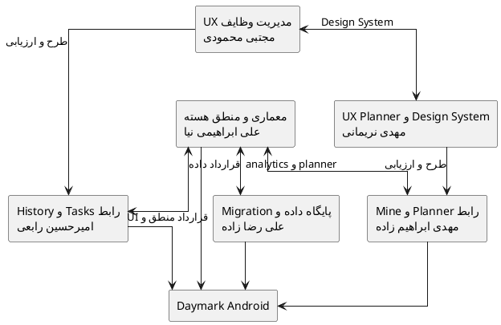

# شرح فعالیت‌ها و مشارکت اعضای تیم

> **پروژه:** Daymark  
> **نوع محصول:** برنامه مدیریت وظایف و برنامه‌ریزی محلی برای Android  
> **تعداد اعضای تیم:** ۶ نفر  
> **فناوری‌های اصلی:** Python 3.11، PySide6/Qt، SQLite، Buildozer و python-for-android

## 1. هدف سند

این سند مسئولیت‌ها، فعالیت‌ها، خروجی‌ها و نحوه همکاری هر عضو تیم Daymark را تشریح می‌کند. تقسیم کار بر پایه تخصص اصلی
اعضا انجام شده است، اما یکپارچه‌سازی، تست نهایی، بازبینی و مستندسازی با همکاری مشترک تیم صورت گرفته است.

## 2. خلاصه ساختار تیم

| عضو تیم           | نقش اصلی                                | حوزه تمرکز                                                  |
|-------------------|-----------------------------------------|-------------------------------------------------------------|
| علی ابراهیمی نیا  | معمار نرم‌افزار و توسعه‌دهنده منطق هسته | معماری، مدل دامنه، recurrence، analytics و یکپارچه‌سازی     |
| امیرحسین رابعی    | توسعه‌دهنده رابط کاربری                 | Tasks، History، فرم‌ها، dialogها و widgetهای تعاملی         |
| مهدی ابراهیم زاده | توسعه‌دهنده رابط کاربری                 | Planner، Settings، Mine، navigation و رفتارهای موبایل       |
| مجتبی محمودی      | طراح UI/UX                              | جریان مدیریت وظیفه، Wireframe، Design System و کاربردپذیری  |
| علی رضا زاده      | توسعه‌دهنده پایگاه داده                 | SQLite، schema، Repository، migration و صحت داده            |
| مهدی نریمانی      | طراح UI/UX                              | تجربه Planner و Settings، پالت‌ها، دسترس‌پذیری و ارزیابی UX |

## 3. علی ابراهیمی نیا

### نقش

معمار نرم‌افزار و توسعه‌دهنده منطق هسته

### فعالیت‌های اصلی

- طراحی معماری Modular Monolith و جداسازی لایه ارائه، دامنه و زیرساخت
- تعیین مرز ماژول‌ها و قرارداد ارتباط میان UI، منطق و Repository
- طراحی مدل‌های دامنه شامل Task، Subtask و Category
- پیاده‌سازی و بازبینی منطق ایجاد، ویرایش، تکمیل، حذف و بازیابی وظایف
- طراحی منطق وظایف تکرارشونده و تولید کنترل‌شده رخداد بعدی
- پیاده‌سازی محاسبات analytics، streak، completion rate و heatmap
- طراحی مدیریت خطا، exception hook و جلوگیری از وضعیت‌های ناسازگار
- هماهنگی یکپارچه‌سازی کدهای رابط، پایگاه داده و طراحی
- بازبینی تغییرات معماری، کارایی و سازگاری ماژول‌ها
- هماهنگی فنی ساخت APK، نسخه‌بندی و آماده‌سازی Release
- تدوین و بازبینی اسناد معماری، نیازمندی‌های فنی و تصمیم‌های کلیدی

### خروجی‌های اصلی

- معماری کلان و نمودارهای Component، Class و Sequence
- مدل‌ها و سرویس‌های منطق هسته
- recurrence و analytics
- قرارداد میان UI و Database
- راهبرد یکپارچه‌سازی، مدیریت خطا و کنترل کیفیت فنی
- بازبینی نهایی سازگاری کد با مستندات

### همکاری با سایر اعضا

- با علی رضا زاده برای تعریف API پایگاه داده، transaction و migration
- با امیرحسین رابعی و مهدی ابراهیم زاده برای اتصال Viewها و Dialogها به منطق هسته
- با مجتبی محمودی و مهدی نریمانی برای تبدیل جریان کاربر به ساختار قابل پیاده‌سازی

## 4. امیرحسین رابعی

### نقش

توسعه‌دهنده رابط کاربری

### فعالیت‌های اصلی

- پیاده‌سازی صفحه Tasks و نمایش گروه‌بندی وظایف
- پیاده‌سازی صفحه History و عملیات بازیابی وظایف
- ساخت فرم ایجاد و ویرایش Task
- پیاده‌سازی فیلدهای عنوان، یادداشت، زیرکار، دسته‌بندی و زمان‌بندی
- توسعه dialogهای Task، Category و Schedule
- ساخت widgetهای reusable و کنترل‌های مناسب لمس
- پیاده‌سازی تعامل Swipe و کنترل نمایش ایمن عملیات Star، Date و Delete
- اتصال رابط کاربری به سرویس‌های منطق هسته و Repository
- مدیریت پیام‌های اعتبارسنجی و بازخورد عملیات کاربر
- اصلاح چیدمان برای صفحه‌کلید موبایل و جلوگیری از clipping
- نوشتن و اجرای تست‌های رابط مربوط به Tasks، History و فرم‌ها
- بازبینی متقابل کدهای رابط با مهدی ابراهیم زاده

### خروجی‌های اصلی

- صفحه Tasks
- صفحه History
- Task Composer و dialogهای اصلی
- widgetهای تعاملی و Swipe Actionها
- اعتبارسنجی و بازخورد بصری عملیات وظیفه
- تست‌های مربوط به فرم‌ها و تعامل‌های اصلی

### همکاری با سایر اعضا

- دریافت طرح‌ها و معیارهای کاربردپذیری از مجتبی محمودی
- هماهنگی با علی ابراهیمی نیا برای قراردادهای منطق هسته
- هماهنگی با علی رضا زاده برای ذخیره و بازیابی داده
- بازبینی مشترک سازگاری بصری با مهدی نریمانی

## 5. مهدی ابراهیم زاده

### نقش

توسعه‌دهنده رابط کاربری

### فعالیت‌های اصلی

- پیاده‌سازی Planner در نماهای روزانه، هفتگی و ماهانه
- توسعه صفحه Settings و تنظیم زبان، ظاهر، پالت و دسته‌بندی
- پیاده‌سازی بخش Mine و نمایش آمار، نمودارها و heatmap
- توسعه navigation پایین صفحه و هماهنگی وضعیت Viewها
- پیاده‌سازی رفتار واکنش‌گرا برای عرض‌ها و ارتفاع‌های مختلف موبایل
- مدیریت تعامل با Android Back و صفحه‌کلید نرم‌افزاری
- جلوگیری از اسکرول افقی و کنترل viewport در Schedule و Planner
- پیاده‌سازی حالت روشن و تاریک و اتصال palette tokenها به Viewها
- اتصال Planner و Mine به analytics، calendar utilities و Database
- اجرای تست‌های UI مربوط به Planner، Settings، Mine و navigation
- بازبینی متقابل رابط با امیرحسین رابعی

### خروجی‌های اصلی

- Day، Week و Month Planner
- Settings
- Mine/Insights
- Bottom Navigation
- Theme و Palette integration
- کنترل رفتار صفحه‌کلید، Back و Scroll

### همکاری با سایر اعضا

- دریافت جریان‌ها و طرح‌های Planner از مهدی نریمانی
- هماهنگی با علی ابراهیمی نیا برای analytics و calendar logic
- هماهنگی با علی رضا زاده برای queryهای تاریخ‌محور و داده تنظیمات
- بازبینی مشترک رابط با امیرحسین رابعی

## 6. مجتبی محمودی

### نقش

طراح UI/UX

### فعالیت‌های اصلی

- تحلیل نیازهای کاربر برای ثبت، مدیریت و تکمیل وظایف
- طراحی User Flow ایجاد، ویرایش، تکمیل، حذف و بازیابی Task
- طراحی Wireframe صفحه Tasks، History و Task Composer
- تعریف سلسله‌مراتب بصری، فاصله‌ها، اندازه کنترل‌ها و الگوی کارت وظیفه
- طراحی رفتار Swipe و نحوه نمایش عملیات ثانویه
- مشارکت در طراحی Design System و قواعد استفاده از componentها
- تعریف معیارهای کاربردپذیری برای فرم‌ها و عملیات اصلی
- بررسی Prototype و ارائه بازخورد قبل از پیاده‌سازی
- انجام Usability Test روی مسیر ثبت و مدیریت وظیفه
- بررسی انطباق پیاده‌سازی امیرحسین رابعی با طرح‌ها
- مشارکت در اصلاح متن‌ها، پیام‌ها و بازخوردهای رابط

### خروجی‌های اصلی

- User Flow مدیریت وظایف
- Wireframe و Mockup صفحات Tasks و History
- طرح Task Composer
- قواعد کارت‌ها، فاصله‌ها و کنترل‌های لمسی
- گزارش ارزیابی کاربردپذیری مسیرهای اصلی

### همکاری با سایر اعضا

- انتقال مشخصات طراحی به امیرحسین رابعی
- هماهنگی با علی ابراهیمی نیا برای امکان‌پذیری فنی جریان‌ها
- همکاری با مهدی نریمانی برای یکپارچگی Design System

## 7. علی رضا زاده

### نقش

توسعه‌دهنده پایگاه داده

### فعالیت‌های اصلی

- طراحی schema جداول tasks، subtasks، categories و settings
- تعریف ارتباط Task و Subtask و قواعد حذف وابسته
- طراحی ارتباط اختیاری Category و حفظ Task هنگام حذف دسته‌بندی
- پیاده‌سازی Repository و عملیات CRUD
- استفاده از SQL پارامتری برای جلوگیری از Injection
- طراحی transaction برای ذخیره چندمرحله‌ای Task و Subtask
- پیاده‌سازی تکمیل و بازیابی وظیفه با حفظ یکپارچگی داده
- ذخیره ارتباط رخدادهای تکرارشونده با `generated_from_id`
- طراحی migration و حفظ داده در ارتقای نسخه
- ایجاد indexهای لازم برای فیلتر وضعیت، تاریخ و دسته‌بندی
- تست rollback، migration، search و queryهای تاریخ‌محور
- بررسی ماندگاری داده پس از restart و نصب نسخه جدید

### خروجی‌های اصلی

- schema و ER Diagram
- `database.py` و قرارداد Repository
- migrationها و indexها
- queryهای وظیفه، دسته‌بندی، تاریخچه و جست‌وجو
- تست‌های یکپارچگی و ماندگاری داده

### همکاری با سایر اعضا

- تعریف قرارداد Repository همراه علی ابراهیمی نیا
- تأمین داده موردنیاز Viewها برای امیرحسین رابعی و مهدی ابراهیم زاده
- بررسی نیازهای ذخیره‌سازی تنظیمات و پالت‌ها با طراحان UI/UX

## 8. مهدی نریمانی

### نقش

طراح UI/UX

### فعالیت‌های اصلی

- طراحی جریان کاربر در Day، Week و Month Planner
- طراحی تجربه Settings و مدیریت زبان، تم، پالت و دسته‌بندی
- طراحی بخش Mine و نحوه نمایش آمار بدون ایجاد فشار روانی
- تعریف پالت‌های Warm Sage، Sky Blue و Aristocratic Green
- طراحی حالت روشن و تاریک و نقش‌های رنگی Design System
- بررسی کنتراست، اندازه هدف لمسی و خوانایی متن
- طراحی رفتار Navigation پایین و وضعیت فعال بخش‌ها
- تعریف معیارهای جلوگیری از clipping و scroll افقی
- انجام آزمون کاربردپذیری Planner، Settings و Mine
- بررسی انطباق پیاده‌سازی مهدی ابراهیم زاده با طراحی
- مشارکت در الزامات دسترس‌پذیری و اخلاق طراحی

### خروجی‌های اصلی

- User Flow بخش Planner و Settings
- طرح Day، Week، Month و Mine
- سیستم رنگ، تم و پالت‌ها
- معیارهای Accessibility و Responsive Layout
- گزارش ارزیابی UX بخش‌های برنامه‌ریزی و تحلیل

### همکاری با سایر اعضا

- انتقال مشخصات طراحی به مهدی ابراهیم زاده
- همکاری با مجتبی محمودی برای Design System مشترک
- هماهنگی با علی ابراهیمی نیا برای نمایش صحیح analytics
- هماهنگی با علی رضا زاده برای ماندگاری تنظیمات ظاهری

## 9. فعالیت‌های مشترک تیم

- بازبینی نیازمندی‌ها و معیارهای پذیرش
- برنامه‌ریزی iterationها و اولویت‌بندی Backlog
- بازبینی کد و اصلاح regressionها
- تست روی دستگاه Android واقعی
- بررسی رفتار صفحه‌کلید، Back، Scroll و Lifecycle
- بررسی سه پالت در حالت روشن و تاریک
- اجرای سناریوهای UAT
- بررسی نصب و ارتقای APK
- تکمیل مستندات و نمودارها
- آماده‌سازی ارائه و Demo دانشگاهی

## 10. ماتریس مسئولیت قابلیت‌ها

| قابلیت                 | مسئول اصلی                          | همکاران                |
|------------------------|-------------------------------------|------------------------|
| مدل Task و منطق عملیات | علی ابراهیمی نیا                    | علی رضا زاده           |
| وظایف تکرارشونده       | علی ابراهیمی نیا                    | علی رضا زاده           |
| Tasks و History        | امیرحسین رابعی                      | مجتبی محمودی           |
| Planner و Settings     | مهدی ابراهیم زاده                   | مهدی نریمانی           |
| Mine و Analytics       | علی ابراهیمی نیا، مهدی ابراهیم زاده | مهدی نریمانی           |
| SQLite و Migration     | علی رضا زاده                        | علی ابراهیمی نیا       |
| Task Composer UX       | مجتبی محمودی                        | امیرحسین رابعی         |
| Planner و Theme UX     | مهدی نریمانی                        | مهدی ابراهیم زاده      |
| Build و Release        | علی ابراهیمی نیا                    | تمام اعضا در تست نهایی |
| مستندسازی              | هر عضو در حوزه خود                  | بازبینی نهایی مشترک    |

## 11. نمودار مسئولیت تیم

فایل مستقل: [`diagrams/14_team_responsibilities.puml`](diagrams/14_team_responsibilities.puml)

## 12. نتیجه‌گیری

تقسیم کار تیم براساس تخصص انجام شده است؛ معماری و منطق هسته، رابط کاربری، طراحی تجربه کاربر و پایگاه داده مالک مشخص
داشته‌اند. مسئولیت‌های میان‌حوزه‌ای مانند تست، بازبینی، مستندسازی و Release نیز به‌صورت مشترک انجام شده‌اند تا خروجی
نهایی از نظر فنی، بصری و داده‌ای یکپارچه باشد.

